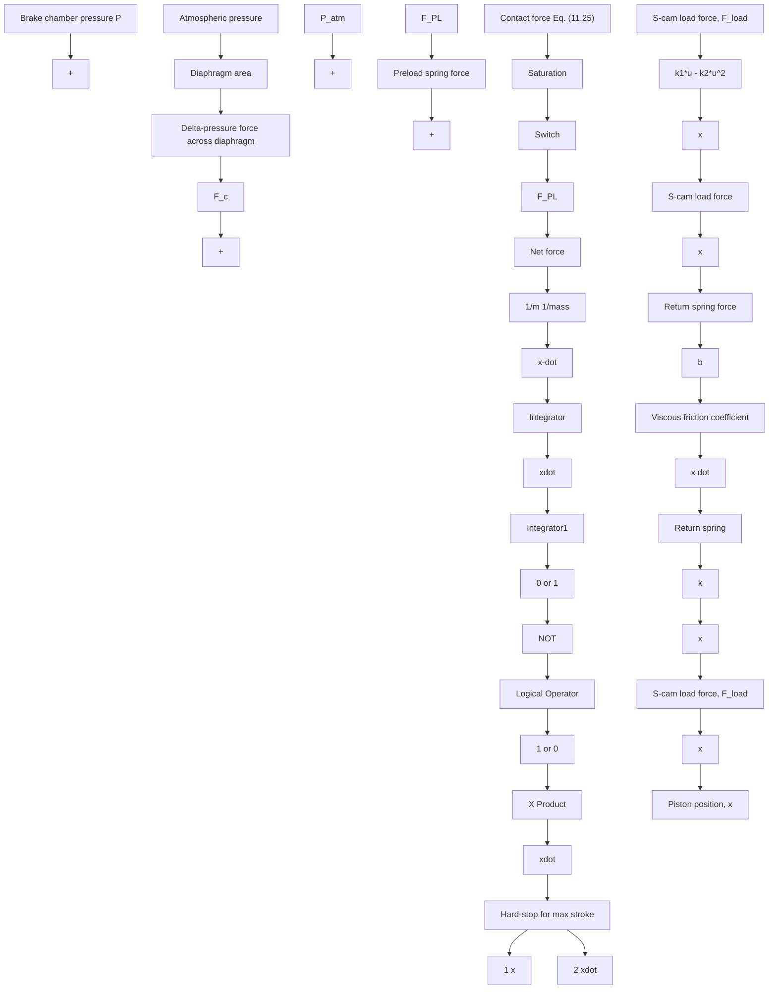

# Air-Brake System Analysis

Next, we present a simulation of the air-brake system under nominal operating conditions with a constant supply pressure $P _ { S } = 5 . 8 4 ( 1 0 ^ { 5 } )$ Pa and step brake-pedal force of 1 N (applied at time $t = 0 . 5 \ : \mathrm { s } )$ . Note that the supply pressure is 5.76 times greater than atmospheric pressure. The Simulink diagram in Fig. 11.25 shows that a 1-N pedal force produces a 0.002 m (2 mm) step displacement of the treadle valve y. Because the height of the valve opening is h = 0.002 m (2 mm), the step pedal-force input produces a step valve area of 4 mm2. Figure 11.29 shows the piston/push-rod response x(t) (in centimeters) to the step valve opening. The push rod reaches its hard-stop limit (4 cm) in less than 0.22 s. Brake chamber pressure P, shown in Fig. 11.30, exhibits an oscillatory behavior during the out-stroke phase as the push rod is displaced to the right. These pressure transients are the result of oscillations in the chamber volume, or piston velocity, which can be observed in the push-rod response x(t) shown in Fig. 11.29. When the push rod reaches its hard-stop limit of 4 cm at approximately $t = 0 . 7 1 { \mathrm { s } } ,$ , the subsequent brake chamber pressure response no longer exhibits

flowchart

