```mermaid
graph TD
    A["Supply pressure"] --> B["P_r"]
    B --> C["Reservoir (drain) pressure"]
    D["Step1"] --> E["e_in"]
    E --> F["Kv*wn^2(s)/s²+2*zeta*wns+wn^2"]
    F --> G["Solenoid/spool valve"]
    G --> H["Spool-valve position y"]
    I["Step2"] --> J["t"]
    J --> K["Clock"]
    K --> L["To Workspace2"]
    M["P_s"] --> N["P_r"]
    N --> O["Orifice valve flow Q1"]
    P["P_s"] --> Q["P_r"]
    Q --> R["Orifice valve flow Q2"]
    S["P1"] --> T["P1"]
    U["P2"] --> V["P2"]
    W["x"] --> X["xdot"]
    Y["x"] --> Z["xdot"]
    AA["x"] --> AB["x"]
    AC["x"] --> AD["x"]
    AE["x"] --> AF["x"]
    AG["x"] --> AH["x"]
    AI["x"] --> AJ["x"]
    AK["x"] --> AL["x"]
    AM["x"] --> AN["x"]
    AO["x"] --> AP["x"]
    AQ["x"] --> AR["x"]
    AS["x"] --> AT["x"]
    AU["x"] --> AV["x"]
    AW["x"] --> AX["x"]
    AY["x"] --> AZ["x"]
    BA["x"] --> BB["x"]
    BC["x"] --> BD["x"]
    BE["x"] --> BF["x"]
    BG["x"] --> BH["x"]
    BI["x"] --> BJ["x"]
    BK["x"] --> BL["x"]
    BM["x"] --> BN["x"]
    BO["x"] --> BP["x"]
    BQ["x"] --> BR["x"]
    BS["x"] --> BT["x"]
    BU["x"] --> BV["x"]
    BW["x"] --> BX["x"]
    BY["x"] --> BZ["x"]
    CA["x"] --> CB["x"]
    CC["x"] --> CD["x"]
    CE["x"] --> CF["x"]
    DG["x"] --> DH["x"]
    DI["x"] --> DJ["x"]
    DK["x"] --> DL["x"]
    DM["x"] --> DJ
    EQ["x"] --> DF["x"]
    DGX["Pressure model Chamber 1"] --> Y
    DGY["Pressure model Chamber 2"] --> Z
    DGZ["Pressure model Chamber 1"] --> AB
    DGY["Pressure model Chamber 2"] --> AC
    DGZ["Pressure model Chamber 1"] --> AD
    DGY["Pressure model Chamber 2"] --> AE
```

Figure 11.34 Simulink diagram for the EHA system.

reservoir pressures, and cylinder pressures are the four inputs to the two orifice-flow subsystems (recall that a valve displacement y will produce two orifice flows, one from $P _ { S }$ to the cylinder and one flow from the cylinder to the reservoir). The two outputs of the orifice-flow subsystems are volumetric-flow rates $Q _ { 1 }$ and $Q _ { 2 }$ , which are inputs to the two pressure-rate subsystems. Piston position and velocity, x and ${ \dot { x } } ,$ are required for the volume and volume-rate terms in the two pressure-rate subsystems and consequently are also input variables. Cylinder pressures $P _ { 1 }$ and $P _ { 2 }$ are the two output variables from the pressure-rate subsystem that become the two inputs for the mechanical subsystem.
