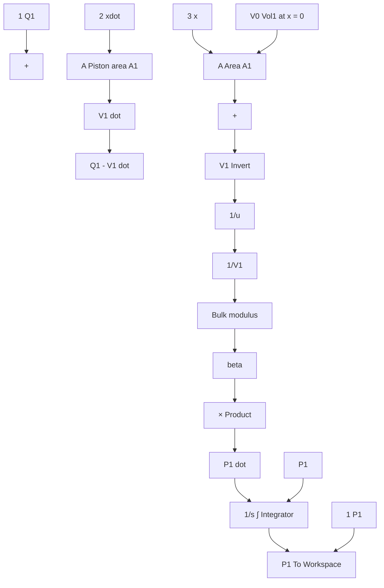
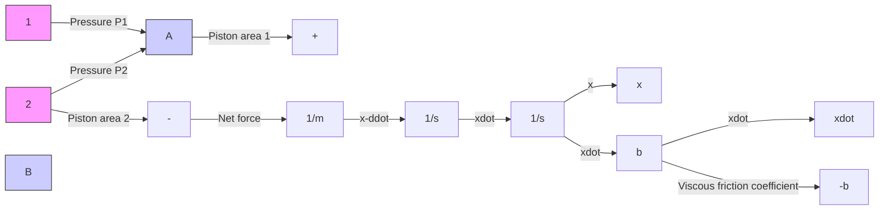

MATLAB M-file 11.4   
```matlab
% flow_Q1.m
%
% This M-file models the volumetric-flow rate of fluid
% in/out of chamber 1. Assumes valve flow is modeled
% by flow through a sharp-edged orifice
%
% Inputs: u (4x1 vector) = [ P_s P_r y P1 ]'
%
P_s = supply pressure, Pa
%
P_r = reservoir pressure (drain), Pa
y = valve displacement, m
%
P1 = pressure of chamber 1, Pa
%
% Output: Q1 = in/out volumetric-flow rate, m^3/s
%
function Q1 = flow_Q1(u)
% system parameter
h = 0.008; % height of valve opening, m
% hydraulic constants
Cd = 0.62; % discharge coefficient
rho = 875; % fluid density, kg/m^3
% System inputs
P_s = u(1); % supply pressure, Pa
P_r = u(2); % reservoir pressure, Pa
y = u(3); % valve displacement, m
P1 = u(4); % pressure in chamber 1, Pa
% Compute valve orifice area
Av = abs(y)*h; % valve orifice area, m^2
% Determine if flow is from supply (y > 0), or if flow
% is out to reservoir pressure (y < 0)
if y >= 0
    % Chamber 1 is connected to the supply, P_s
    % (flow is positive if P_s > P1)
    Q1 = Cd*Av*sign(P_s - P1)*sqrt( 2*abs(P_s - P1)/rho );
else
    % Chamber 1 is connected to the reservoir, P_r
    % (flow is negative if P1 > P_r)
    Q1 = -Cd*Av*sign(P1 - P_r)*sqrt( 2*abs(P1 - P_r)/rho );
end 
```


<details>
<summary>flowchart</summary>


</details>

Figure 11.35 Cylinder pressure subsystem (chamber 1) for the EHA.


<details>
<summary>flowchart</summary>


</details>

Figure 11.36 Mechanical subsystem for the EHA.
