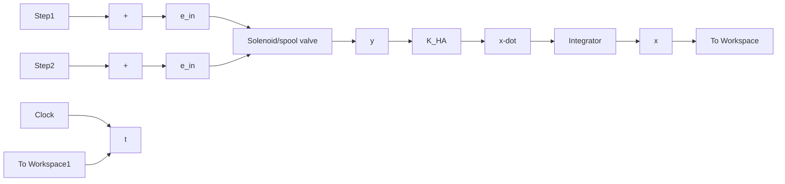

and because the reference condition is zero flow $( Q _ { 1 } ^ { * } = 0 \mathrm { a n d } y ^ { * } = 0 )$ , we can use $\delta Q _ { 1 } = Q _ { 1 }$ and $\delta y = y$ in the linearized flow equation (11.52)

$$Q _ {1} = C _ {d} h \sqrt {\frac {P _ {S}}{\rho}} y \tag {11.55}$$

If we assume steady, incompressible flow where $\dot { P } _ { 1 } = 0$ , the volumetric-flow rate $Q _ { 1 }$ is equal to the time derivative of chamber volume $( { \dot { V } } _ { 1 } = A { \dot { x } } )$ and Eq. (11.55) becomes

$$C _ {d} h \sqrt {\frac {P _ {S}}{\rho}} y = A \dot {x} \tag {11.56}$$

Solving Eq. (11.56) for the piston velocity, we obtain

$$\dot {x} = K _ {\mathrm{HA}} y \tag {11.57}$$

where the “hydraulic actuator” gain is

$$K _ {\mathrm{HA}} = \frac {C _ {d} h}{A} \sqrt {\frac {P _ {S}}{\rho}} \tag {11.58}$$

The linearized solution for the piston stroke x(t) is simply the integral of Eq. (11.57)

$$x (t) = x _ {0} + K _ {\mathrm{HA}} \int y d t \tag {11.59}$$

where $x _ { 0 }$ is the initial stroke at time $t = 0$ . In other words, the complex, nonlinear EHA model shown in Fig. 11.34 can be replaced by a single integrator block. Figure 11.40 shows a Simulink model of the linearized EHA system, which consists of the voltage input $e _ { \mathrm { i n } } ( t )$ , the second-order linear solenoid–valve model, and the single integrator that represents the linear I/O equation relating spool-valve position y and piston stroke x. Of course, the linearized EHA model does not provide information about cylinder pressures.

flowchart

Figure 11.40 Simulink model of the linearized EHA system.

line

| Time, s | Nonlinear EHA model | Linear EHA model |
| --- | --- | --- |
| 0 | 30 | 30 |
| 0.5 | 30 | 30 |
| 1 | 41 | 41 |
| 2 | 41 | 41 |

Figure 11.41 Piston position responses to a pulse input for nonlinear and linear EHA models.
