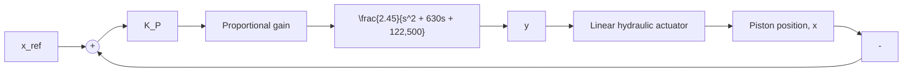

# Feedback Control System Design

The goal of the feedback system is precise position control for a reference position (stroke) command. We begin with a proportional control scheme, where the solenoid-voltage signal $e _ { \mathrm { i n } } ( t )$ is proportional to the position error. Figure 11.42 shows a proportional feedback control system where $x _ { \mathrm { r e f } }$ is the reference position command for the piston rod. Note that we are using the simple linear hydraulic actuator model, which is an integrator block with numerator $K _ { \mathrm { H A } } = 1 0 8 0 . 9 \mathrm { s } ^ { - 1 }$ . The proportional-control gain is $K _ { P }$ , and it has units of

flowchart

Figure 11.42 Proportional control for the linear EHA model.

V/m because it converts a position error (m) to a voltage signal. We can check the steady-state accuracy of the proposed control scheme by calculating the closed-loop transfer function

$$T (s) = \frac {K _ {P} G (s)}{1 + K _ {P} G (s) H (s)} \tag {11.60}$$

where G(s) is the forward transfer function

$$G (s) = \frac {2 6 4 8 . 1 5}{s (s ^ {2} + 6 3 0 s + 1 2 2 , 5 0 0)} \tag {11.61}$$

and H(s) is the feedback transfer function (unity in this case). Consequently, the closed-loop transfer function in Eq. (11.60) becomes

$$T (s) = \frac {2 6 4 8 . 1 5 K _ {P}}{s ^ {3} + 6 3 0 s ^ {2} + 1 2 2 , 5 0 0 s + 2 6 4 8 . 1 5 K _ {P}} \tag {11.62}$$

Because the DC gain of the closed-loop transfer function, $T ( s = 0 )$ , is unity for any positive value of the proportional gain $K _ { P } { \mathrm { : } }$ , the proportional-control system will exhibit zero steady-state error for a constant reference position command. Recall that our steady-state error analysis in Chapter 10 showed that a type 1 system (i.e., one integrator in the forward transfer function) exhibits zero steady-state error for a constant input, and a finite steady-state error for a ramp input. Clearly, Fig. 11.42 shows that our linearized EHA model is a type 1 system because the hydraulic actuator model is an integrator.
