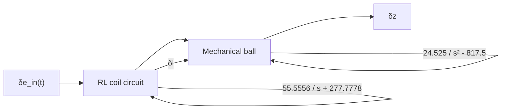

Note that the perturbation in the second input, $\delta u _ { 2 } = \delta g$ , is zero because $\delta g = g - g ^ { * } = 0$ . In other words, there can never be a change in gravitational acceleration from its nominal value as g is a constant. Hence, Eqs. (11.75) and (11.76) are both I/O equations

$$\delta \dot {I} + 2 7 7. 7 7 8 \delta I = 5 5. 5 5 5 6 \delta e _ {\mathrm{in}} \quad \text { and } \quad \delta \ddot {z} - 8 1 7. 5 \delta z = 2 4. 5 2 5 \delta I$$

which can be written as two transfer functions:

${ \mathrm { R L ~ c i r c u i t : } } \quad G _ { 1 } ( s ) = { \frac { 5 5 . 5 5 5 6 } { s + 2 7 7 . 7 7 7 8 } } = { \frac { \delta I ( s ) } { \delta E _ { \mathrm { i n } } ( s ) } }$ (11.77)

$\mathrm { M e c h a n i c a l ~ b a l l } \colon\ G _ { 2 } ( s ) = { \frac { 2 4 . 5 2 5 } { s ^ { 2 } - 8 1 7 . 5 } } = { \frac { \delta Z ( s ) } { \delta I ( s ) } }$ (11.78)

flowchart

Figure 11.51 Open-loop block diagram of linearized maglev system.

Figure 11.51 shows an open-loop block diagram of the linearized maglev system described by transfer functions (11.77) and (11.78). Note that the “linearized” RL circuit transfer function (11.77) is identical to the original RL circuit model (11.65) because it was linear to begin with. The mechanical ball transfer function (11.78) is a linearized version of Eq. (11.68) and has been linearized about a nominal air gap of 24 mm and coil current of 0.8 A. Finally, the reader should note that the poles of the two transfer functions are

$$\text { RL circuit: } \quad s + 2 7 7. 7 7 7 8 = 0 \quad \rightarrow s = - 2 7 7. 7 7 7 8\text { Mechanical ball: } \quad s ^ {2} - 8 1 7. 5 = 0 \quad \rightarrow s = \pm 2 8. 5 9 2 0$$

Therefore, the three poles are identical to the three eigenvalues of the system matrix A.

At this point, it would be useful to compare open-loop simulations of the nonlinear and linearized maglev systems in order to determine the accuracy of the linearization results. However, this system is unstable, so any “standard” input (step, impulse, etc.) would result in an unstable response. We will test and compare the closed-loop system using the nonlinear and linearized plant in the next section as a means to check the accuracy of the linearization process. To do this, we must develop a closed-loop control system that produces a stable maglev system.
