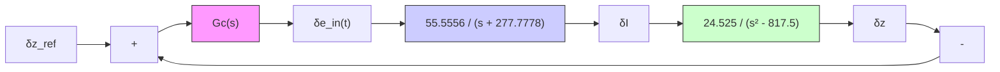

# Maglev Control System Design

The goal is to design a feedback control system for position control of the metal ball. As previously mentioned, we will use the linearized maglev system so that we can use our standard control system analysis tools (root locus and Bode plots) which only apply to LTI systems. Figure 11.52 shows a control system where $\delta z _ { \mathrm { r e f } }$ is the reference position command and $G _ { C } ( s )$ is the controller transfer function. The reader should note that every variable in the closed-loop control system is a perturbation from the nominal value. Recall that a transfer function may only be used when a system has zero initial conditions. In the case of the maglev system, we assume that the system begins in static equilibrium: source voltage is $e _ { \mathrm { i n } } ^ { \ast } ( t )$ , coil current is $I ^ { * }$ , and ball position is $z ^ { * } = 0$ (levitating). Therefore, all perturbations variables $( \delta \mathbf { x } = \mathbf { x } - \mathbf { \bar { x } } ^ { * } )$ ) are initially zero.

Let us begin the control system design with a simple proportional controller $G _ { C } ( s ) = K _ { P }$ . Figure 11.53 shows the root-locus plot for a P-controller. Note that the two open-loop poles originating at $s = \pm 2 8 . 5 9 2 0$ (mechanical ball transfer function) move toward each other, meet at the origin, break away from the real axis, and follow $\pm 6 0 ^ { \circ }$ asymptotes as the P-gain is increased from zero to infinity. Because one root-locus

Reference

position,

flowchart

Figure 11.52 Closed-loop control of the linearized maglev system.

line

| Real Axis | Imaginary Axis |
| --- | --- |
| -300 | 0 |
| 0 | 0 |
| 300 | -600 |

Figure 11.53 Root locus for linearized maglev system with P-controller.
