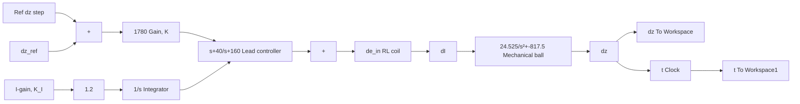

Figure 11.56 Simulink model of the linearized maglev system with lead-plus-integral controller.

line

| Time, s | Lead controller only | Lead + integral controller |
| --- | --- | --- |
| 0.0 | 0.0 | 0.0 |
| 0.1 | 5.3 | -2.5 |
| 0.2 | -0.5 | -0.2 |
| 0.3 | -0.8 | -0.6 |
| 0.4 | -0.9 | -0.7 |
| 0.5 | -0.9 | -0.7 |
| 0.6 | -0.9 | -0.7 |
| 0.7 | -0.9 | -0.7 |
| 0.8 | -0.9 | -0.7 |

Figure 11.57 Voltage commands for the linearized maglev system: lead controller and lead-plus-integral controller.

It is important at this point to summarize our approach and the results of our analysis. We have linearized the maglev system so that we can utilize the root-locus method to design the controller transfer function. Using the root locus we have successfully designed a lead controller for a good transient response; later, we added an integral control loop to eliminate the steady-state tracking error. All analyses and simulations were performed in terms of the perturbation variables $( \mathrm { i } . \mathrm { e } . , \delta z , \delta I , \delta e _ { \mathrm { i n } } )$ , which is a necessary by-product of the linearization approach.

The final test is to use the lead-plus-integral controller in a closed-loop simulation of the maglev system using the complete nonlinear mathematical model. The previous linearized results are of little use if the controller design cannot stabilize or adequately control the nonlinear maglev system. The first step is to develop a numerical simulation of the nonlinear maglev system dynamics represented by Eqs. (11.65) and (11.68). Figure 11.58 shows a Simulink model of the closed-loop nonlinear maglev system using subsystem blocks for the electromagnet coil and mechanical ball. It is important to note that the “true” dynamic variables (i.e., z, I, and $e _ { \mathrm { i n } } )$ are used in the nonlinear simulation instead of the perturbation variables $\delta z , \delta I ,$ , and $\delta e _ { \mathrm { i n } } .$ .
