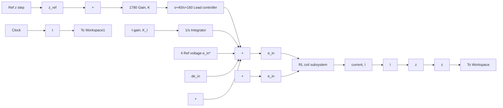

flowchart

```mermaid
graph LR
    A["Ref z step"] --> B["z_ref"]
    B --> C["+"]
    C --> D["1780 Gain, K"]
    D --> E["s+40/s+160 Lead controller"]
    E --> F["+"]
    F --> G["e_in"]
    G --> H["RL coil subsystem"]
    H --> I["current, I"]
    I --> J["I"]
    J --> K["z"]
    K --> L["z"]
    L --> M["To Workspace"]
    N["Clock"] --> O["t"]
    O --> P["To Workspace1"]
    Q["I-gain, K_I"] --> R["1/s Integrator"]
    R --> F
    S["4 Ref voltage e_in*"] --> F
    T["de_in"] --> F
    U["+"] --> F
    V["+"] --> W["e_in"]
    W --> H
```

Figure 11.58 Simulink model of nonlinear maglev system with lead-plus-integral controller.
