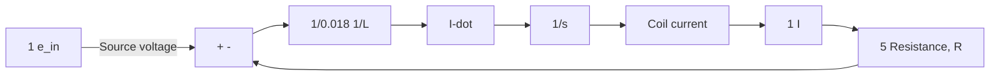
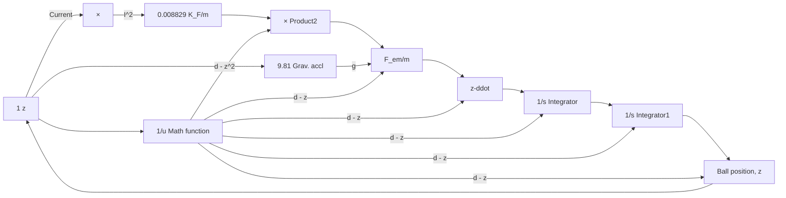

Figure 11.61 shows the closed-loop step responses of the nonlinear and linearized maglev models. As before, the reference position $z _ { \mathrm { r e f } } ( t )$ is a 3-mm step function applied at time $t = 0 . 1 \ : \mathrm { s }$ . The nonlinear model response shows slightly more peak overshoot than the linearized model response but otherwise the two responses are very similar. The closed-loop response of the nonlinear maglev model (the true test for the controller design) is stable and tracks the reference command at steady state. Figure 11.62 shows that the controller voltage commands for the nonlinear and linearized models are very similar.

flowchart

Figure 11.59 Nonlinear maglev system: electromagnet coil subsystem.

flowchart

Figure 11.60 Nonlinear maglev system: mechanical ball subsystem.

line

| Time, s | Nonlinear maglev model | Linearized maglev model | Reference step input |
| --- | --- | --- | --- |
| 0.1 | 0.0072 | 0.0072 | 0.003 |
| 0.2 | 0.003 | 0.003 | 0.003 |
| 0.3 | 0.0033 | 0.0033 | 0.003 |
| 0.4 | 0.003 | 0.003 | 0.003 |
| 0.5 | 0.003 | 0.003 | 0.003 |
| 0.6 | 0.003 | 0.003 | 0.003 |
| 0.7 | 0.003 | 0.003 | 0.003 |
| 0.8 | 0.003 | 0.003 | 0.003 |

Figure 11.61 Closed-loop step responses of the linearized and nonlinear maglev systems using the lead-plus-integral controller.

line

