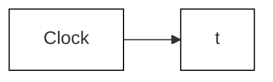

Function Block Parameters: Transfer Fcn
Transfer Fcn
The numerator coefficient can be a vector or matrix expression. The denominator coefficient must be a vector. The output width equals the number of rows in the numerator coefficient. You should specify the coefficients in descending order of powers of s.
Parameters
Numerator coefficients:
[4 1]
Denominator coefficients:
[2 6 30]
Absolute tolerance:
auto
State Name: (e.g., 'position')
"
OK Cancel Help Apply

Figure C.2 Setting the transfer function parameters (Example C.1).

Before executing the simulation, the user should set the run time and the parameters that define the numerical integration process. To do this, select the Model Configuration Parameters option under the Simulation menu in the model workspace window. Figure C.4 shows the Configuration Parameters dialog box for setting start/stop times and solver options. Typically, the start time is zero (default value); the stop time has been set to 4 s. While the variable-order, variable-step solver ode45 is a reliable and stable option for performing the numerical integration, it may take large step sizes in order to maximize computational efficiency. Large step sizes will lead to “choppy” plots of the output variable y(t). One solution is to decrease the maximum step size in the Configuration Parameters dialog box. Another option is to select the fixed-step, fourth-order Runge–Kutta method (ode4) as the numerical solver. Figure C.4 shows the Configuration Parameters dialog box where the numerical solver ode4 is selected and the fixed-step size is set to 0.01 s.

flowchart

flowchart

Figure C.3 Simulink model using a transfer function (Example C.1).   

text_image

