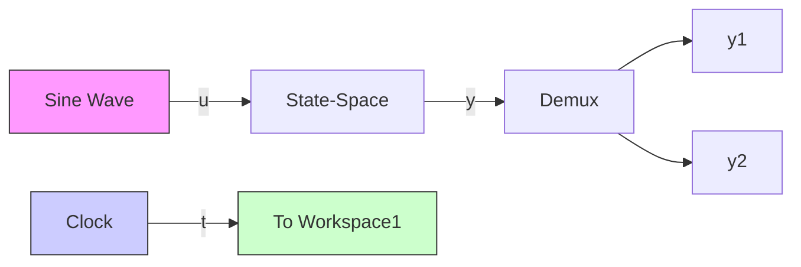

Next, the user must define the sinusoidal input function and send the outputs to storage (MATLAB workspace). The user can drag and drop the Sine Wave block from the Sources library to the Simulink template and connect it to the input port of the State-Space block. Double clicking on the Sine Wave block opens a dialog box where the user can set the amplitude equal to 0.8 and the input frequency to 12 rad/s. The output of the State-Space block is the vector $\mathbf { y } ( t ) = \left[ y _ { 1 } y _ { 2 } \right] ^ { T }$ . If this vector output signal is sent directly to the workspace as a single variable ${ \mathrm { y } } ,$ , then plotting y versus time t will produce the two curves $y _ { 1 } ( t )$ and $y _ { 2 } ( t )$ ) on the same figure. An alternative method is to “split” the output vector y into two scalar signals $y _ { 1 }$ 1 and $y _ { 2 }$ using the “de-multiplexer” or Demux block from the Signal Routing library. The user can open the dialog box for the Demux and change the number of output ports if needed (the default value of 2 outputs works for this example). Figure C.6 shows the completed Simulink model with Demux “splitting” the output vector y and sending $y _ { 1 }$ and $y _ { 2 }$ to two separate To Workspace blocks for storage. Note that we have shown the vector signal path (output y) as a wide, bold line by selecting this option in Signals & Ports under the Display drop-down menu.

text_image

Function Block Parameters: State-Space
State Space
State-space model:
dx/dt = Ax + Bu
y = Cx + Du
Parameters
A:
[ 0 1 ; -20 -4 ]
B:
[ 0 ; 0.7 ]
C:
eye(2)
D:
zeros(2,1)
Initial conditions:
[-0.02 ; 0.1 ]
Absolute tolerance:
auto
State Name: (e.g., 'position')
" OK Cancel Help Apply

Figure C.5 Setting state-space matrices and initial states (Example C.2).

flowchart

Figure C.6 Simulink model using an SSR (Example C.2).
