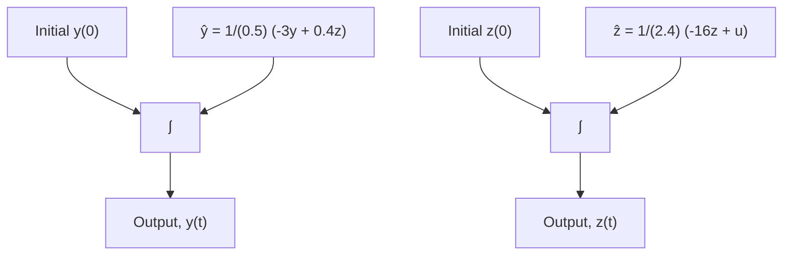
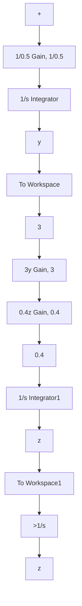

To reverse the direction of any I/O block, highlight the block and use the Flip Block command under the Diagram > Rotate & Flip menu of the Simulink model.
Now the complete feedback paths for the ẏ integrator can be created as shown in Fig.
C.8 (of course it is easier to create and place the Gain and Sum blocks first and then pick off and route the feedback signals to the appropriate I/O blocks).
Finally, a left-to-right Gain block is inserted to multiply the Sum output 0.4z − 3y by the factor 1/0.5, as required by Eq.
(C.8).
The reader should be able to trace the signal paths of the Simulink model in Fig.
C.8 and verify that they create the governing ODE for ẏ , that is, Eq.
(C.8).

flowchart

Figure C.7 Numerical integration of the two ODEs (Example C.3).

flowchart

Figure C.8 Partially completed Simulink model for Eq. (C.8) (Example C.3).

Next, we complete the Simulink model construction by inserting a second summing junction Sum block to create the signal u(t) − 16z that is required for the ż integrator. Figure C.9 shows the completed Simulink model. The Step block (from the Sources library) is added, and opening its dialog box allows the user to set the initial value to zero, step time to 1, and final value equal to 3.5 in order to create the desired input function u(t). The user must remember to set the proper initial conditions by double clicking each Integrator block and entering the numerical values for y(0) and z(0). Finally, the desired numerical integration parameters can be set in the Simulation > Model Configuration Parameters dialog box.
