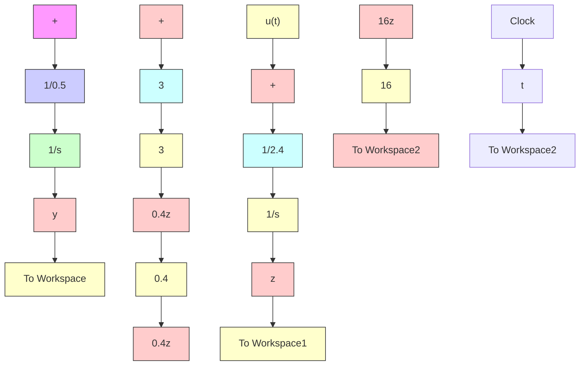

Figure C.10 shows a plot of the simulation results for y(t) and z(t) after executing the Simulink model in Fig. C.9. The two dynamic variables decay to zero from their respective initial conditions. At time t = 1 s, the step function is applied and both dynamic variables show an exponential rise to their steady-state values.

flowchart

Figure C.9 Simulink model for Eqs. (C.8) and (C.9) (Example C.3).   

line

| Time, s | y(t) | z(t) |
| --- | --- | --- |
| 0.0 | -0.3 | 0.55 |
| 0.5 | -0.05 | 0.05 |
| 1.0 | 0.0 | 0.0 |
| 1.5 | 0.02 | 0.2 |
| 2.0 | 0.03 | 0.22 |
| 2.5 | 0.03 | 0.22 |
| 3.0 | 0.03 | 0.22 |

Figure C.10 System responses y(t) and z(t) (Example C.3).
