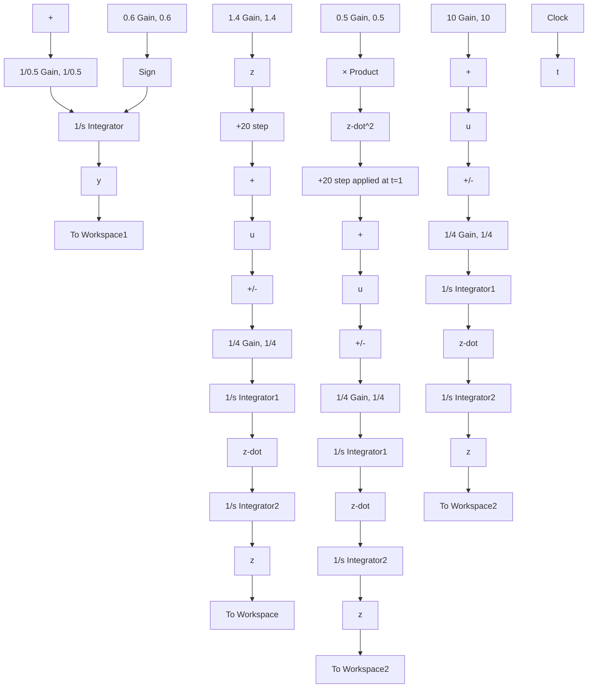

flowchart

Figure C.11 Simulink model of nonlinear Eqs. (C.12) and (C.13) (Example C.4).

Figure C.11 shows that the signal ż is the first and second input to the Product block, which creates $\dot { z } ^ { 2 }$ as the output. The reader should be able to verify that the signal paths in Fig. C.11 correctly represent the system equations (C.12) and (C.13).

The desired input function is a rectangular pulse of 20 that lasts for 1 s. One way to create this input signal is to sum together two step functions: the first step has a constant value of 20 and “steps $\mathsf { u p } ^ { \mathsf { , , } }$ at time $t = 0 ,$ , and the second step has a constant value of −20 and “steps down” at time t = 1 s. Of course when they are summed together we get a pulse function with value 20 for $0 < t < 1$ s and zero input for $t \geq 1 \mathrm { s }$ . Figure C.11 shows the summation of the two Step blocks from the Sources library. The desired initial values, final values, and step times can be set in the dialog boxes of each Step block.
