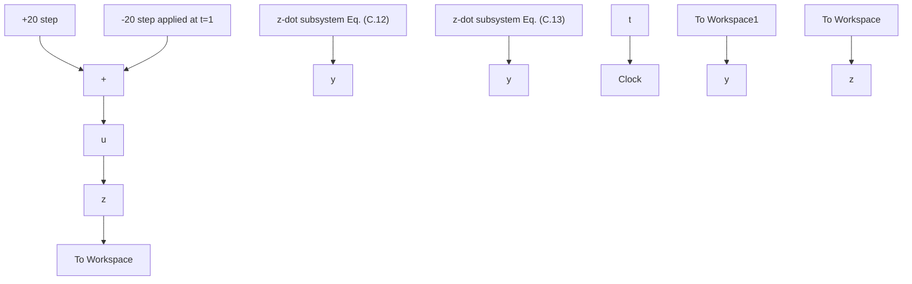
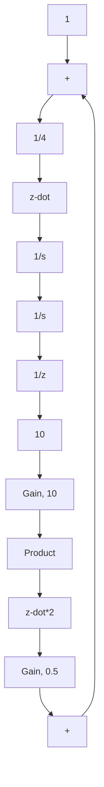

subgraph "Time-domain signals"
        J["+20 step"] --> K["+"]
        L["-20 step applied at t=1"] --> K
        K --> M["u"]
        M --> N["+"]
        N --> O["1/4 Gain, 1/4"]
        O --> P["1/s Integrator1"]
        P --> Q["z-dot"]
        Q --> R["1/s Integrator2"]
        R --> S["z"]
        S --> T["To Workspace"]
        U["0.5 Gain, 0.5"] --> V["x Product"]
        W["0.6 Gain, 0.6"] --> V
        V --> W
        X["10 Gain, 10"] --> Y["Gain, 10"]
    end

subgraph "Output Time"
        Z["Clock"] --> AA["t To Workspace2"]
    end
```
</details>

Figure C.13 Creating a subsystem for Eq. (C.12) (Example C.4).


<details>
<summary>flowchart</summary>


</details>

Figure C.14 Simulink model using subsystems (Example C.4).


<details>
<summary>flowchart</summary>


</details>

Figure C.15 Block-diagram details of the z-ddot subsystem (Example C.4).

the inner model. Figure C.15 shows a screen shot of the dialog box that appears upon double clicking the z-ddot subsystem in Fig. C.14. This dialog box presents the subsystem’s inner block-diagram details for representing Eq. (C.13).
