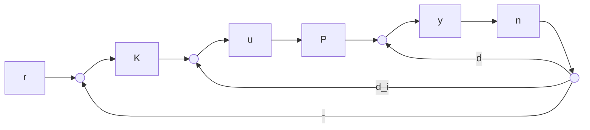

# Loop-Shaping Design Procedure

(1) Loop-Shaping: The singular values of the nominal plant, as shown in Figure 16.3, are shaped, using a precompensator $W _ { 1 }$ and/or a postcompensator $W _ { 2 }$ , to give a desired open-loop shape. The nominal plant $P$ and the shaping functions $W _ { 1 } , W _ { 2 }$ are combined to form the shaped plant, $P _ { s }$ , where $P _ { s } = W _ { 2 } P W _ { 1 }$ . We assume that $W _ { 1 }$ and $W _ { 2 }$ are such that $P _ { s }$ contains no hidden modes.

flowchart

Figure 16.3: Standard feedback configuration

(2) Robust Stabilization: a) Calculate $\epsilon _ { \mathrm { m a x } } ~ ( \mathrm { i . e . , } ~ b _ { \mathrm { o p t } } ( P _ { s } ) )$ , where

$$
\begin{array}{l} \epsilon_ {\max} = \left(\inf _ {K \text {   stabilizing }} \left\| \left[ \begin{array}{c} I \\ K \end{array} \right] (I + P _ {s} K) ^ {- 1} \tilde {M} _ {s} ^ {- 1} \right\| _ {\infty}\right) ^ {- 1} \\ = \sqrt {1 - \left\| \left[ \begin{array}{c c} \tilde {N} _ {s} & \tilde {M} _ {s} \end{array} \right] \right\| _ {H} ^ {2}} <   1 \\ \end{array}
$$

and $\tilde { M } _ { s } , \tilde { N } _ { s }$ define the normalized coprime factors of $P _ { s }$ such that $P _ { s } = \tilde { M } _ { s } ^ { - 1 } \tilde { N } _ { s }$ and

$$\tilde {M} _ {s} \tilde {M} _ {s} ^ {\sim} + \tilde {N} _ {s} \tilde {N} _ {s} ^ {\sim} = I.$$

If $\epsilon _ { \mathrm { m a x } } \ll 1$ return to (1) and adjust $W _ { 1 }$ and $W _ { 2 }$ .

b) Select $\epsilon \leq \epsilon _ { \mathrm { m a x } } ;$ then synthesize a stabilizing controller $K _ { \infty }$ that satisfies

$$
\left\| \left[ \begin{array}{c} I \\ K _ {\infty} \end{array} \right] (I + P _ {s} K _ {\infty}) ^ {- 1} \tilde {M} _ {s} ^ {- 1} \right\| _ {\infty} \leq \epsilon^ {- 1}.
$$

(3) The final feedback controller K is then constructed by combining the $\mathcal { H } _ { \infty }$ controller $K _ { \infty }$ with the shaping functions $W _ { 1 }$ and $W _ { 2 }$ , as shown in Figure 16.4, such that

$$K = W _ {1} K _ {\infty} W _ {2}.$$
