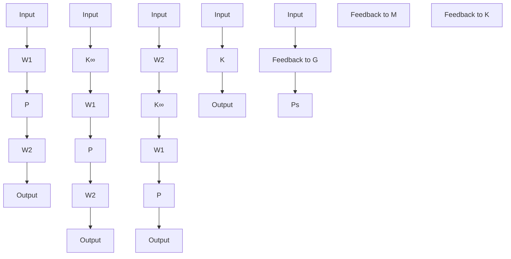

A typical design works as follows: the designer inspects the open-loop singular values of the nominal plant and shapes these by pre- and/or postcompensation until nominal performance (and possibly robust stability) specifications are met. (Recall that the open-loop shape is related to closed-loop objectives.) A feedback controller $K _ { \infty }$ with associated stability margin (for the shaped plant) $\epsilon \leq \epsilon _ { \mathrm { m a x } } .$ is then synthesized. I $\mathrm { f } \ \epsilon _ { \mathrm { m a x } }$ is small, then the specified loop shape is incompatible with robust stability requirements and should be adjusted accordingly; then $K _ { \infty }$ is reevaluated.

In the preceding design procedure we have specified the desired loop shape by $W _ { 2 } P W _ { 1 }$ . But after Stage (2) of the design procedure, the actual loop shape achieved is, in fact, given by $W _ { 1 } K _ { \infty } W _ { 2 } P$ at plant input and $P W _ { 1 } K _ { \infty } W _ { 2 }$ at plant output. It is therefore possible that the inclusion of $K _ { \infty }$ in the open-loop transfer function will cause deterioration in the open-loop shape specified by $P _ { s }$ . In the next section, we will show that the degradation in the loop shape caused by the $\mathcal { H } _ { \infty }$ controller $K _ { \infty }$ is limited at frequencies where the specified loop shape is sufficiently large or sufficiently small. In particular, we show in the next section that  can be interpreted as an indicator of the success of the loop-shaping in addition to providing a robust stability guarantee for the closed-loop systems. A small value of $\epsilon _ { \mathrm { m a x } } \ ( \epsilon _ { \mathrm { m a x } } \ll 1 )$ in Stage (2) always indicates incompatibility between the specified loop shape, the nominal plant phase, and robust closed-loop stability.

flowchart

Figure 16.4: The loop-shaping design procedure
