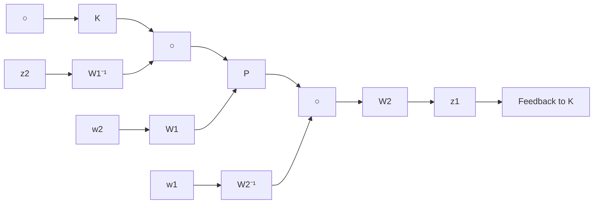

Remark 16.1 Note that, in contrast to the classical loop-shaping approach, the loopshaping here is done without explicit regard for the nominal plant phase information. That is, closed-loop stability requirements are disregarded at this stage. Also, in contrast with conventional $\mathcal { H } _ { \infty }$ design, the robust stabilization is done without frequency weighting. The design procedure described here is both simple and systematic and only assumes knowledge of elementary loop-shaping principles on the part of the designer.

✸

Remark 16.2 The preceding robust stabilization objective can also be interpreted as the more standard $\mathcal { H } _ { \infty }$ problem formulation of minimizing the $\mathcal { H } _ { \infty }$ norm of the frequency-weighted gain from disturbances on the plant input and output to the con-

troller input and output as follows:

$$
\begin{array}{l} \left\| \left[ \begin{array}{c} I \\ K _ {\infty} \end{array} \right] (I + P _ {s} K _ {\infty}) ^ {- 1} \tilde {M} _ {s} ^ {- 1} \right\| _ {\infty} = \left\| \left[ \begin{array}{c} I \\ K _ {\infty} \end{array} \right] (I + P _ {s} K _ {\infty}) ^ {- 1} \left[ \begin{array}{c c} I & P _ {s} \end{array} \right] \right\| _ {\infty} \\ = \left\| \left[ \begin{array}{c} W _ {2} \\ W _ {1} ^ {- 1} K \end{array} \right] (I + P K) ^ {- 1} \left[ \begin{array}{c c} W _ {2} ^ {- 1} & P W _ {1} \end{array} \right] \right\| _ {\infty} \\ = \left\| \left[ \begin{array}{c} I \\ P _ {s} \end{array} \right] (I + K _ {\infty} P _ {s}) ^ {- 1} \left[ \begin{array}{c c} I & K _ {\infty} \end{array} \right] \right\| _ {\infty} \\ = \left\| \left[ \begin{array}{c} W _ {1} ^ {- 1} \\ W _ {2} P \end{array} \right] (I + K P) ^ {- 1} \left[ \begin{array}{c c} W _ {1} & K W _ {2} ^ {- 1} \end{array} \right] \right\| _ {\infty} \\ \end{array}
$$

This shows how all the closed-loop objectives in equations (16.1) and (16.2) are incorporated. As an example, it is easy to see that the signal relationship in Figure 16.5 is given by

$$
\left[ \begin{array}{c} z _ {1} \\ z _ {2} \end{array} \right] = \left[ \begin{array}{c} W _ {2} \\ W _ {1} ^ {- 1} K \end{array} \right] (I + P K) ^ {- 1} \left[ \begin{array}{c c} W _ {2} ^ {- 1} & P W _ {1} \end{array} \right] \left[ \begin{array}{c} w _ {1} \\ w _ {2} \end{array} \right].
$$

flowchart

Figure 16.5: An equivalent $\mathcal { H } _ { \infty }$ formulation
