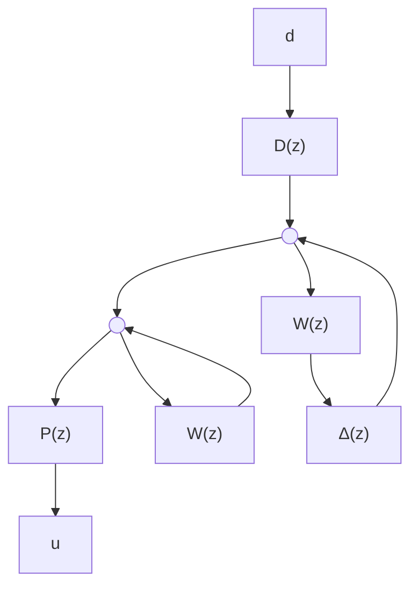

which is obviously necessary. In fact, the last condition holds for stable, linear, timevarying operator ∆ with supu6=0 k k $\Delta$ $\begin{array} { r } { \operatorname* { s u p } _ { u \neq 0 } \frac { \| \Delta u \| _ { 2 } } { \| u \| _ { 2 } } \leq 1 } \end{array}$ k∆uk2u ≤ 1; see Poolla et al. [1994]. Note that if $u _ { 0 } ~ \ne ~ 0$ , then $T _ { u }$ 2is of full column rank and the condition can also be written as $\overline { { \sigma } } \left( T _ { y } ( T _ { u } ^ { * } T _ { u } ) ^ { - \frac { 1 } { 2 } } \right) \leq 1$ .

Using the above theorem, we can derive solutions to some model validation problems easily. For example, consider a set of additive models shown in Figure 18.1.

flowchart

Figure 18.1: Model validation for additive uncertainty

In this case,

$$y = (P + \Delta W) u + D d, \quad \| \Delta \| _ {\infty} \leq 1$$

where $P ( z ) , W ( z ) , D ( z )$ and $\Delta ( z )$ are causal, linear, time-invariant systems (but not necessarily stable). The disturbance d is assumed to come from a convex set, $d \in \mathcal { D } _ { \mathrm { c o n v e x } } ;$ for example, ${ \mathcal { D } } _ { \mathrm { c o n v e x } } = \{ d : d \in \ell _ { 2 } [ 0 , \infty ) , \| d \| _ { 2 } \leq 1 \}$ . For simplicity, we shall also assume that $W ( \infty )$ is of full column rank. Let

$$D (z) = D _ {0} + D _ {1} z ^ {- 1} + D _ {2} z ^ {- 2} + \dots .$$

Theorem 18.2 Given a set of input-output data $u _ { \mathrm { e x p t } } = ( u _ { 0 } , u _ { 1 } , \dots , u _ { \ell - 1 } )$ with $u _ { 0 } \neq 0$ , $y _ { \mathrm { e x p t } } = ( y _ { 0 } , y _ { 1 } , \dots , y _ { \ell - 1 } )$ for the additive perturbed uncertainty system with an additive disturbance $d \in \mathcal { D } _ { \mathrm { c o n v e x } ; }$ , where $\mathcal { D } _ { \mathrm { c o n v e x } }$ is a convex set, let

$$\hat {u} = (\hat {u} _ {0}, \hat {u} _ {1}, \dots , \hat {u} _ {\ell - 1}) = \pi_ {\ell} (W u _ {\mathrm{expt}})\hat {y} = (\hat {y} _ {0}, \hat {y} _ {1}, \dots , \hat {y} _ {\ell - 1}) = y _ {\mathrm{expt}} - \pi_ {\ell} P u _ {\mathrm{expt}}.$$

Then there exists a $\Delta \in \mathcal { H } _ { \infty } , \| \Delta \| _ { \infty } \leq 1$ such that

$$y _ {\mathrm{expt}} = \pi_ {\ell} ((P + \Delta W) u _ {\mathrm{expt}} + D d)$$
