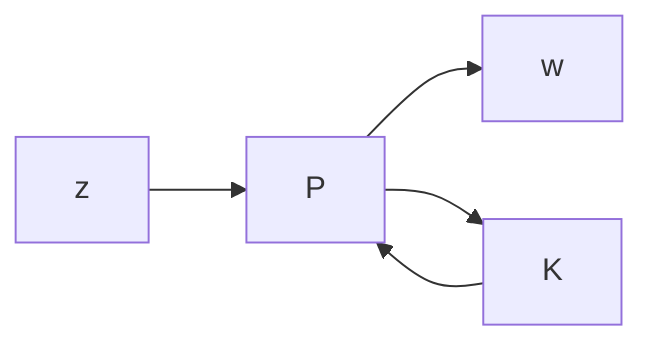

We are now in the position to consider the synthesis problem with mixed uncertainties. Consider again the general system diagram in Figure 18.4. $\mathrm { B y }$ the robust performance condition, we need to find a stabilizing controller $K$ so that

$$\min _ {K} \sup _ {\omega} \mu_ {\Delta} \left(\mathcal {F} _ {\ell} (P, K)\right) \leq \beta .$$

flowchart

Figure 18.4: Synthesis framework

By Theorems 18.3 and 18.4, $\mu _ { \Delta } \left( \mathcal { F } _ { \ell } \left( P ( j \omega ) , K ( j \omega ) \right) \right) \leq \beta ,$ , ∀ω if there are frequencydependent scaling matrices $D _ { \omega } \in \mathcal { D }$ and $G _ { \omega } \in \mathcal { G }$ such that

$$\sup _ {\omega} \overline {{\sigma}} \left[ \left(\frac {D _ {\omega} \left(\mathcal {F} _ {\ell} (P (j \omega) , K (j \omega))\right) D _ {\omega} ^ {- 1}}{\beta} - j G _ {\omega}\right) (I + G _ {\omega} ^ {2}) ^ {- \frac {1}{2}} \right] \leq 1, \quad \forall \omega .$$

Similar to the complex µ synthesis, we can now describe a mixed $\mu$ synthesis procedure that involves $D , G - K$ iterations.
