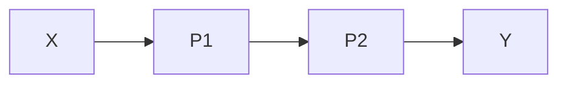
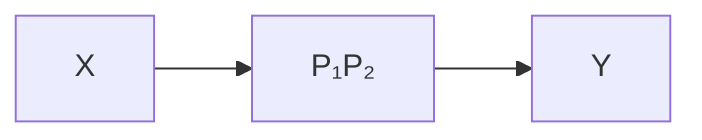

# A.1 Cascaded blocks

$$Y = (P _ {1} P _ {2}) X \tag {A.1}$$

flowchart

```mermaid
graph LR
    X --> P1
    P1 --> P2
    P2 --> Y
```

Figure A.1: Cascaded blocks

flowchart

```mermaid
graph LR
    X --> P1["P₁P₂"]
    P1 --> Y
```

Figure A.2: Simplified cascaded blocks
