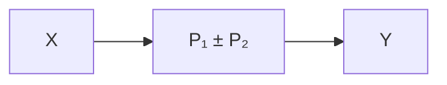

# A.2 Combining blocks in parallel

$$Y = P _ {1} X \pm P _ {2} X \tag {A.2}$$


<details>
<summary>flowchart</summary>

```mermaid
graph TD
    X --> P1["P₁"]
    X --> P2["P₂"]
    P1 --> Sum((+))
    P2 --> Sum
    Sum --> Y
    Sum --> ±[±]
```
</details>

Figure A.3: Parallel blocks


<details>
<summary>flowchart</summary>


</details>

Figure A.4: Simplified parallel blocks
