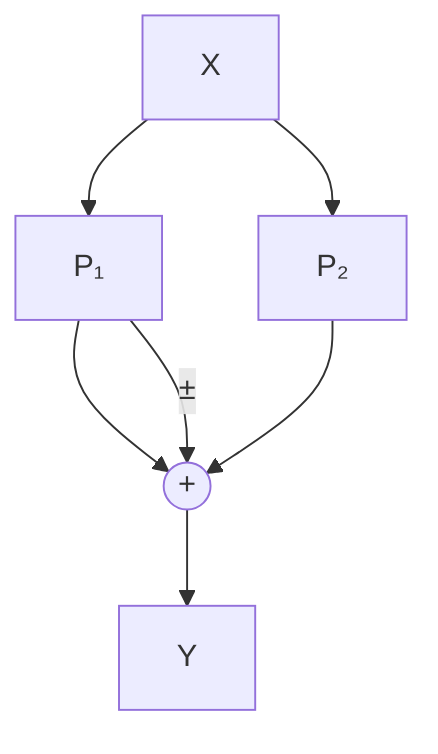
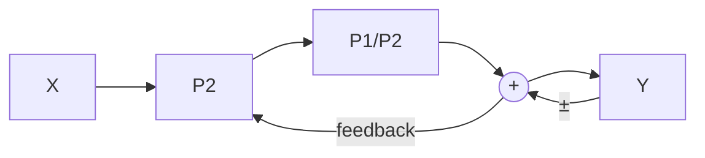

# A.3 Removing a block from a feedforward loop

$$Y = P _ {1} X \pm P _ {2} X \tag {A.3}$$

flowchart

```mermaid
graph TD
    X --> P1["P₁"]
    X --> P2["P₂"]
    P1 --> Sum((+))
    P2 --> Sum
    Sum --> Y["Y"]
    P1 -->|±| Sum
```

Figure A.5: Feedforward loop

flowchart

```mermaid
graph LR
    X --> P2["P2"]
    P2 --> P1["P1/P2"]
    P1 --> sum((+))
    sum --> Y
    Y -->|±| sum
    sum -->|feedback| P2
```

Figure A.6: Transformed feedforward loop
