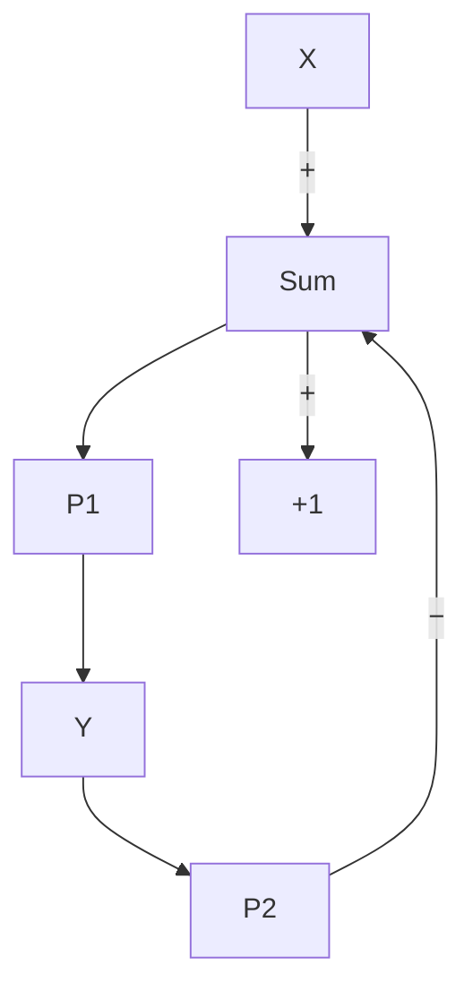
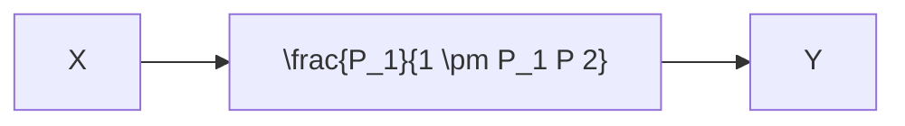

# A.4 Eliminating a feedback loop

$$Y = P _ {1} (X \mp P _ {2} Y) \tag {A.4}$$

flowchart

```mermaid
graph TD
    X --> |+| Sum
    Sum --> P1
    P1 --> Y
    Y --> P2
    P2 --> |−| Sum
    Sum --> |+| +1
```

Figure A.7: Feedback loop

flowchart

```mermaid
graph LR
    X --> A["\frac{P_1}{1 \pm P_1 P 2}"]
    A --> Y
```

Figure A.8: Simplified feedback loop
