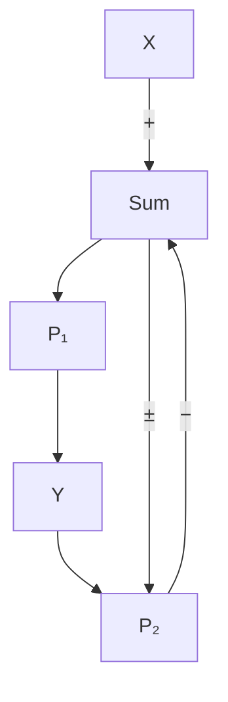
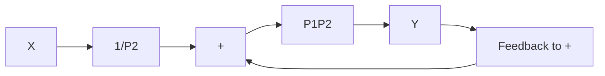

# A.5 Removing a block from a feedback loop

$$Y = P _ {1} (X \mp P _ {2} Y) \tag {A.5}$$

flowchart

```mermaid
graph TD
    X --> |+| Sum
    Sum --> P1["P₁"]
    P1 --> Y
    Y --> P2["P₂"]
    P2 --> |−| Sum
    Sum --> |±| P2
```

Figure A.9: Feedback loop

flowchart

```mermaid
graph LR
    X --> A["1/P2"]
    A --> B["+"]
    B --> C["P1P2"]
    C --> Y
    Y --> D["Feedback to +"]
    D --> B
```

Figure A.10: Transformed feedback loop
