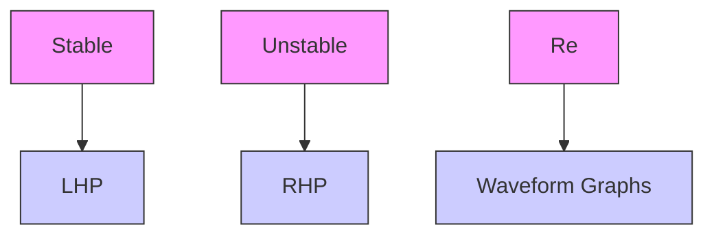

# Poles and zeroes

The roots of factors in the numerator of a transfer function are called zeroes because they make the transfer function approach zero. Likewise, the roots of factors in the denominator of a transfer function are called poles because they make the transfer function approach infinity; on a 3D graph, these look like the poles of a circus tent (see figure E.1).

When the factors of the denominator are broken apart using partial fraction expansion into something like A $\begin{array} { r } { \frac { A } { s + a } + \frac { B } { s + b } } \end{array}$ Bs+b , the constants A and B are called residues, which determine how much each pole contributes to the system response.

The factors representing poles are each the Laplace transform of a decaying exponential.[2] That means the time domain responses of systems comprise decaying exponentials $( \mathbf { e } . \mathbf { g } . , y = e ^ { - t } )$ .

R Imaginary poles and zeroes always come in complex conjugate pairs (e.g., 2 + 3i, 2 3i).

The locations of the closed-loop poles in the complex plane determine the stability of the system. Each pole represents a frequency mode of the system, and their location determines how much of each response is induced for a given input frequency. Figure

surface_3d

| Re(σ) | Im(jω) | H(s) |
|-------|--------|------|
| -20   | 0      | -    |
| -10   | 0      | -    |
| 0     | 0      | Peak |
| 10    | 0      | Peak |
| 20    | 0      | -    |

Figure E.1: Equation (E.1) plotted in 3D

E.2 shows the impulse responses in the time domain for transfer functions with various pole locations. They all have an initial condition of 1.

flowchart

Figure E.2: Continuous impulse response vs pole location

Poles in the left half-plane (LHP) are stable; the system’s output may oscillate but it converges to steady-state. Poles on the imaginary axis are marginally stable; the system’s output oscillates at a constant amplitude forever. Poles in the right half-plane (RHP) are unstable; the system’s output grows without bound.
