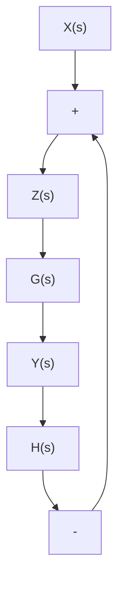

# Derivation

Given the feedback network in figure E.3, find an expression for Y (s).

$$
\begin{array}{l} Y (s) = Z (s) G (s) \\ Z (s) = X (s) - Y (s) H (s) \\ X (s) = Z (s) + Y (s) H (s) \\ X (s) = Z (s) + Z (s) G (s) H (s) \\ \end{array}
$$

flowchart

Figure E.3: Closed-loop block diagram

$$
\begin{array}{l} \frac {Y (s)}{X (s)} = \frac {Z (s) G (s)}{Z (s) + Z (s) G (s) H (s)} \\ \frac {Y (s)}{X (s)} = \frac {G (s)}{1 + G (s) H (s)} \tag {E.2} \\ \end{array}
$$

A more general form is

$$\frac {Y (s)}{X (s)} = \frac {G (s)}{1 \mp G (s) H (s)} \tag {E.3}$$

where positive feedback uses the top sign and negative feedback uses the bottom sign.
