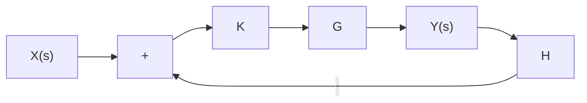

# Control system with feedback

flowchart

Figure E.4: Feedback controller block diagram

X(s) input H measurement transfer function

K controller gain Y (s) output

G plant transfer function

Following equation (E.3), the transfer function of figure E.4, a control system diagram with negative feedback, from input to output is

$$G _ {c l} (s) = \frac {Y (s)}{X (s)} = \frac {K G}{1 + K G H} \tag {E.4}$$

The numerator is the open-loop gain and the denominator is one plus the gain around the feedback loop, which may include parts of the open-loop gain. As another example, the transfer function from the input to the error is

$$G _ {c l} (s) = \frac {E (s)}{X (s)} = \frac {1}{1 + K G H} \tag {E.5}$$

The roots of the denominator of $G _ { c l } ( s )$ are different from those of the open-loop transfer function $K G ( s )$ . These are called the closed-loop poles.
