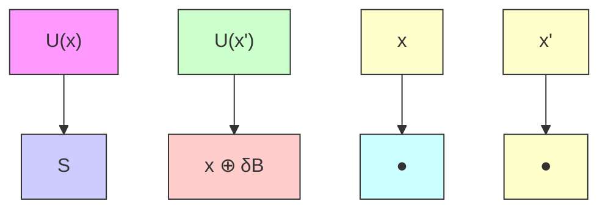
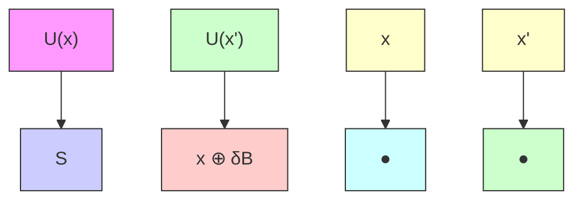

# C.3.1 Outer and Inner Semicontinuity

The concepts of inner and outer semicontinuity were introduced by Rockafellar and Wets (1998, p. 144) to replace earlier definitions of lower and upper semicontinuity of set-valued functions. This section is based on the useful summary provided by Polak (1997, pp. 676-682).

Definition C.23 (Outer semicontinuous function). A set-valued function $U : \mathbb { R } ^ { n }  \mathbb { R } ^ { m }$ is said to be outer semicontinuous (osc) at $x \operatorname { i f } U ( x )$

flowchart

(a) Outer semicontinuity.

flowchart

(b) Inner semicontinuity.   
Figure C.11: Outer and inner semicontinuity of $U ( \cdot )$ .

is closed and if, for every compact set S such that $U ( x ) \cap S = \emptyset$ , there exists a $\delta > 0$ such that $U ( x ^ { \prime } ) \cap S = \emptyset$ for all $ { \boldsymbol { x } } ^ { \prime } \in  { \boldsymbol { x } } \oplus \delta  { \mathcal { B } } . ^ { 4 }$ The set-valued function $U : \mathbb { R } ^ { n }  \mathbb { R } ^ { m }$ is outer semicontinuous if it is outer semicontinuous at each $\boldsymbol { x } \in \mathbb { R } ^ { n }$ .
