# C.2.5 Tangent and Normal Cones

The material in this section is not required for Chapters 1-7; it is presented merely to show that alternative definitions of tangent and normal cones are useful in more complex situations than those considered above. Thus, the normal and tangent cones defined in C.2.1 have some limitations when U is not convex or, at least, not similar to the constraint set illustrated in Figure C.4. Figure C.6 illustrates the type of difficulty that may occur. Here the tangent cone $\mathcal { T } _ { U } ( u )$ is not convex, as shown in Figure C.6(b), so that the associated normal cone $\hat { N } _ { U } ( u ) ~ = ~ { \mathcal T } _ { U } ( u ) ^ { * } ~ = ~ \{ 0 \}$ . Hence the necessary condition of optimality of u for the problem of minimizing a differentiable function $f ( \cdot )$

```mermaid
graph TD
    A["u"] --> B["N_U(u)"]
    A --> C["g ∈ Ñ_U(u^ν)"]
    D["Û(u) = {0}"] --> E["..."]
    F["Û(u) = {0}"] --> G["..."]
    H["Û(u) = {0}"] --> I["..."]
    J["Û(u) = {0}"] --> K["..."]
    L["Û(u) = {0}"] --> M["..."]
    N["Û(u) = {0}"] --> O["..."]
    P["Û(u) = {0}"] --> Q["..."]
    R["Û(u) = {0}"] --> S["..."]
    T["Û(u) = {0}"] --> U["..."]
    V["Û(u) = {0}"] --> W["..."]
    X["Û(u) = {0}"] --> Y["..."]
    Z["Û(u) = {0}"] --> AA["..."]
    AB["Û(u) = {0}"] --> AC["..."]
    AD["Û(u) = {0}"] --> AE["..."]
    AF["Û(u) = {0}"] --> AG["..."]
    AH["Û(u) = {0}"] --> AI["..."]
    AJ["Û(u) = {0}"] --> AK["..."]
    AL["Û(u) = {0}"] --> AM["..."]
    AN["Û(u) = {0}"] --> AO["..."]
    AP["Û(u) = {0}"] --> AQ["..."]
    AR["Û(u) = {0}"] --> AS["..."]
    AT["Û(u) = {0}"] --> AU["..."]
    AV["Û(u) = {0}"] --> AW["..."]
    AX["Û(u) = {0}"] --> AY["..."]
    AZ["Û(u) = {0}"] --> BA["..."]
    BB["Û(u) = {0}"] --> BC["..."]
    BD["Û(u) = {0}"] --> BE["..."]
    BF["Û(u) = {0}"] --> BG["..."]
    BH["Û(u) = {0}"] --> BI["..."]
    BJ["Û(u) = {0}"] --> BK["..."]
    BL["Û(u) = {0}"] --> BM["..."]
    BN["Û(u) = {0}"] --> BO["..."]
    BP["Û(u) = {0}"] --> BQ["..."]
    BR["Û(u) = {0}"] --> BS["..."]
    BT["Û(u) = {0}"] --> BU["..."]
    BV["Û(u) = {0}"] --> BW["..."]
    BX["Û(u) = {0}"] --> BY["..."]
    BZ["Û(u) = {0}"] --> BY["..."]
    ZY["Û(u) = {0}"] --> ZYB["..."]
    BAZ["Û(u) = {0}"] --> BAZB["..."]
    BBZ["Û(u) = {0}"] --> BBZB["..."]
    BZA["Û(u) = {0}"] --> BZA8["..."]
    BZA8 --> BZA9["..."]
    CCZ["Û(u) = {0}"] --> CCZB["..."]
    CCZB --> CCZ9["..."]
    CCX["Û(u) = {0}"] --> CCX8["..."]
    CCX8 --> CCX9["..."]
```

flowchart

(a) Normal cones.
