```mermaid
graph TD
    A["Start of alignment"] --> B["Start free flight"]
    B --> C["Launch point 3"]
    C --> D["CM"]
    D --> E["2"]
    E --> F["CM"]
    F --> G["5"]
    G --> H["WP"]
    H --> I["6"]
    I --> J["WP"]
    J --> K["7"]
    K --> L["Map centers"]
    L --> M["Last map center in a map area"]
    M --> N["Intermediate TC map"]
    N --> O["WP"]
    O --> P["9"]
    P --> Q["WP"]
    Q --> R["10"]
    R --> S["WP"]
    S --> T["11"]
    T --> U["Final TC maps"]
    U --> V["WP"]
    V --> W["12"]
    W --> X["WP"]
    X --> Y["13"]

style A fill:#f9f,stroke:#333
    style B fill:#f9f,stroke:#333
    style C fill:#f9f,stroke:#333
    style D fill:#f9f,stroke:#333
    style E fill:#f9f,stroke:#333
    style F fill:#f9f,stroke:#333
    style G fill:#f9f,stroke:#333
    style H fill:#f9f,stroke:#333
    style I fill:#f9f,stroke:#333
    style J fill:#f9f,stroke:#333
    style K fill:#f9f,stroke:#333
    style L fill:#f9f,stroke:#333
    style M fill:#f9f,stroke:#333
    style N fill:#f9f,stroke:#333
    style O fill:#f9f,stroke:#333
    style P fill:#f9f,stroke:#333
    style Q fill:#f9f,stroke:#333
    style R fill:#f9f,stroke:#333
    style S fill:#f9f,stroke:#333
    style T fill:#f9f,stroke:#333
    style U fill:#f9f,stroke:#333
    style V fill:#f9f,stroke:#333
    style W fill:#f9f,stroke:#333
    style X fill:#f9f,stroke:#333
```

Fig. 7.4. Example flight route.

Navigation System Requirements As stated earlier, the navigation accuracy module (NAM) is designed to function as a part of the cruise missile MPS, which provides the following specific navigation data:

(a) Navigation error ellipse description at specified points along the route of flight.   
(b) The probability of overflight of each terrain-correlation map area associated with the route of flight.   
(c) The circular error probable (CEP) at specified points along the route of flight.   
(d) The launch footprint, which allows successful acquisition of any desired terrain correlation map along the route of flight.
