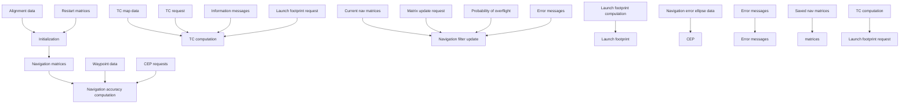

Fig. 7.6. NAM data flow.

Figure 7.6 illustrates the overall logical data flow for NAM. Input data from a record in the IOBT (input/output buffer table) determine a segment of the cruise missile route for which navigation errors are calculated and appropriate output data generated. These outputs are stored in the IOBT record. Processing of the IOBT data is conducted by elements as summarized in Table 7.1.

The program elements and functions of Table 7.1 will now be discussed in more detail.

NAM Inputs and Outputs The inputs and outputs of the NAM system are contained in CPU-resident buffer tables (i.e., in the IOBT ). However, it is necessary for the calling program to execute a pre-NAM data processing function to construct these buffer tables from a database whose structure uses the joint route point table (JRPT ). The five tables containing data required by NAM are (1) navigation initialization table, (2) terrain correlation table, (3) JRPT table, (4) error table, and (5) launch footprint table. Upon completion of NAM execution the required NAM outputs as previously described are available in the buffer tables for calling program processing/merging into the database or for use by the clobber analysis module, the operator, or the mission planning system (MPS).

NAM Subprogram Modules Description The major modules of the NAM system that are the primary candidates for testing are described below.

1. NAM Data Format Validation: This module checks the IOBT data entries for NAM input to ensure that the parameters are within specified boundary constraints. A

Table 7.1. Summary of NAM Program Elements and Functions
