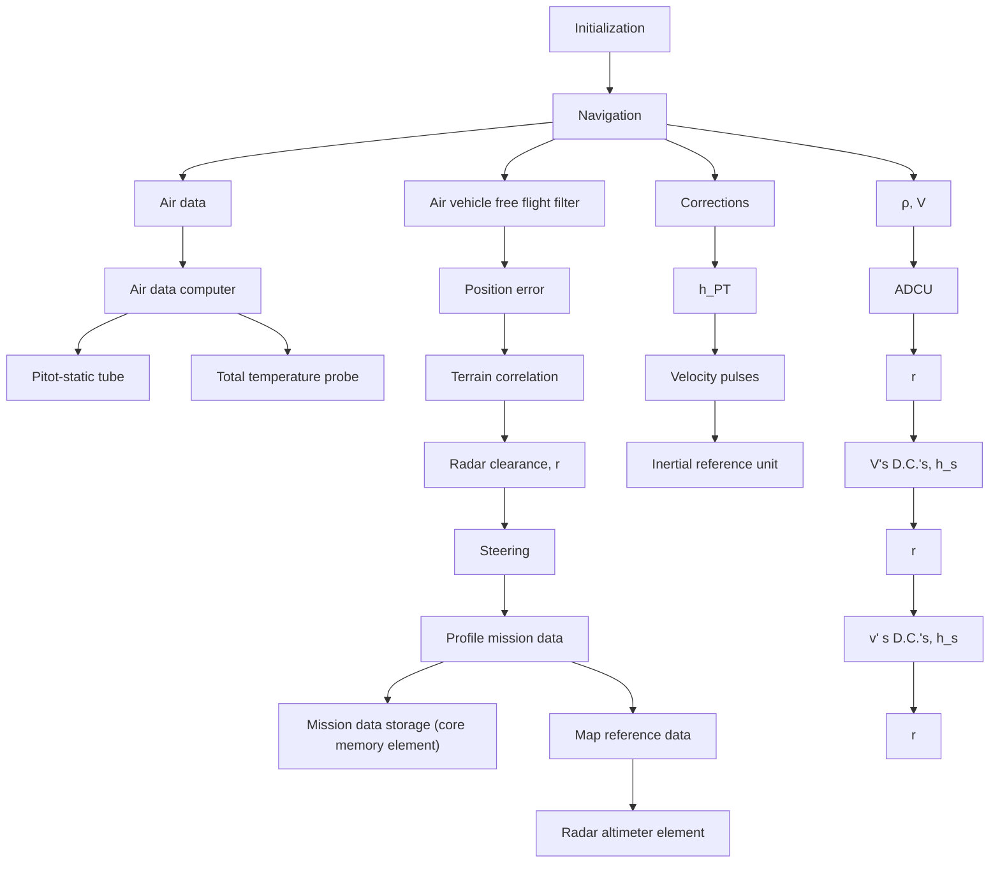

DC’s = Direction cosines (i.e., $C _ { x x } , C _ { x y } , C _ { x z } , \mathrm { e t c } )$   
H = system altitude   
ADCU = Air data control unit

Fig. 7.7. Typical free flight navigation function.

channel during terrain following. The vertical channel thus accurately computes a reference altitude so that terrain correlation can be performed during any type of altitude changes over the maps. One additional feature of the system is the resetting of altitude h at each terrain correlation update. The system altitude $h _ { s }$ is reset so that no transients are introduced into the system. For more information on the vertical channel mechanization, the reader is referred to [8].
