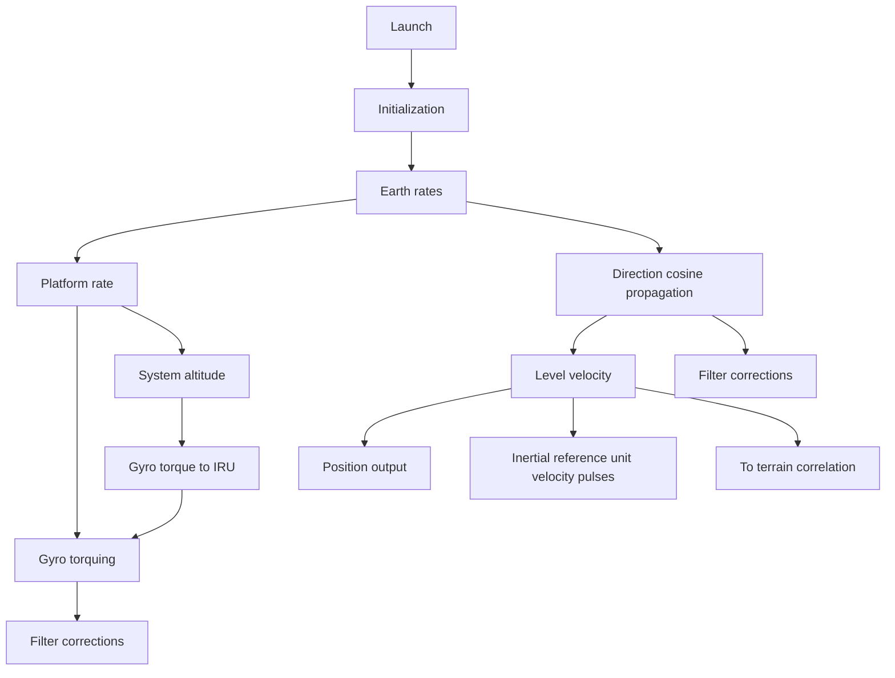

Early in the design of the cruise missile, it was decided that a Kalman filter would be the best design to improve the performance of the inertial navigation system. Therefore, the Kalman filter is provided for correcting navigation system error. The mechanization of the Kalman filter consists of four modules as follows: (1) initialization, (2) data processor, (3) propagation, and (4) update module. The Kalman filter calculations are designed for use in platform alignment and making navigation corrections based on externally supplied data (e.g., terrain correlation and/or GPS). These modules will now be discussed in a little more detail. The initialization module initializes the covariance matrix elements, propagation noise matrix elements, gyro error model parameters, and counters that control update and propagation periods. Execution of the Kalman calculations is controlled in part by the Kalman data processor module. The Kalman propagation module includes the covariance matrix propagation and dynamics matrix subroutines and solves the matrix Riccati differential equation. The Kalman update module calculates the state error vector and updates the covariance matrix.

flowchart

Fig. 7.8. Inertial navigation functional diagram.
