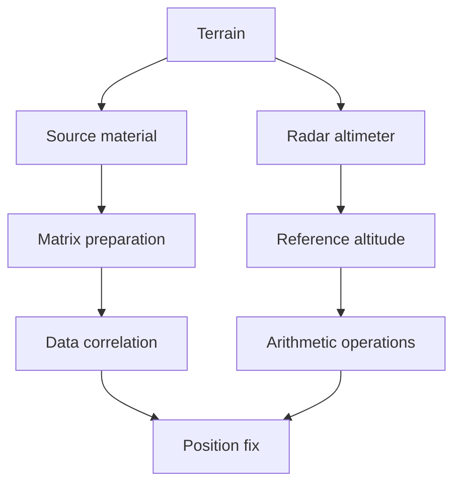
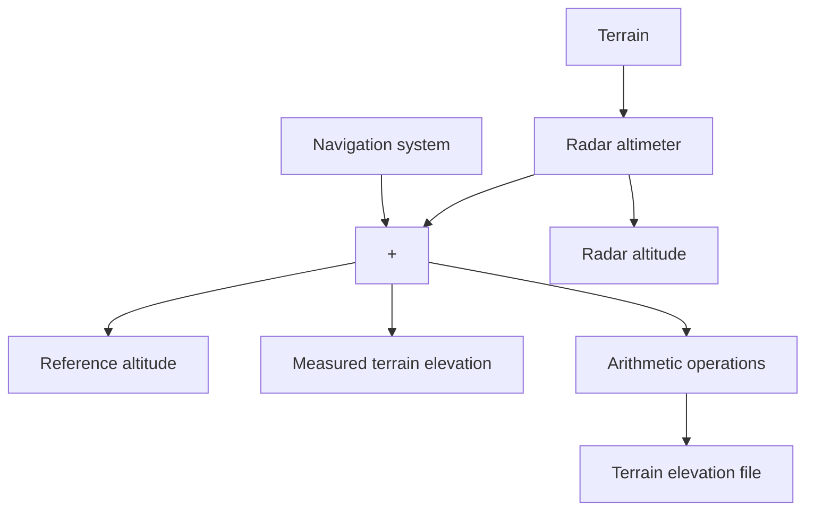

The left side of the diagram describes the reference data loop. Source material in the form of survey maps or stereo-photographs of the terrain are used to collect the set of altitudes that constitute the reference matrix. The right side of the diagram describes the data acquisition loop. The radar altimeter acquires altitude estimates above terrain. As described above, the radar altimeter output is differenced with the system’s reference altitude. Various arithmetic operations (e.g., mean removal and quantization) are then performed on the differenced data. Finally, the correlation between the stored and acquired data is performed with the MAD function, and a position fix is determined.

Figure 7.12 can be modified to reflect the TERCOM measurement process. This is done in Figure 7.13.

As the missile flies over the fix point area, data is acquired by sampling the output from the radar altimeter that is measuring the height of the vehicle above the terrain (see Figure 7.14). The radar altitude is sampled at uniform distances along the air vehicle’s ground track with at least one altitude measurement being taken for each cell distance d traveled. However, several measurements are usually taken during the crossing of each matrix area cell, and the average of the measurements is stored as the measured radar (terrain clearance) altitude for that cell.

flowchart

Fig. 7.12. Generalized TERCOM system.

flowchart

Fig. 7.13. Terrain measurement block diagram.
