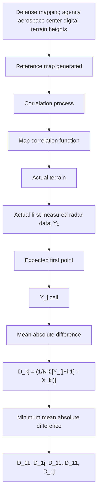

The terrain correlation process discussed here utilizes a long sample–short matrix concept (see also Section 7.4.3) and uses the mean absolute difference (MAD) algorithm. The terrain correlation system has several design features that give improved performance and provide mission planning flexibility. These are:

(a) There is no processing limit on map size or cell size.   
(b) There is a dual-stage option for those maps with a large number of cells that might have a time limitation imposed by mission planning. The dual stage first correlates every other correlation point, thus saving a factor of 4 in processing time. The second step correlates all the nearest 24 positions to the minimum found from the first step.   
(c) An altitude update is computed in addition to the horizontal position update.   
(d) A residue interpolation is done on the correlation function. This improves the correlator accuracy, since the update is no longer limited to the accuracy of a cell. The residue interpolation uses the downtrack and crosstrack neighbors in the correlation residue matrix and finds a “best” smooth curve through the residue points in each direction.

flowchart

Fig. 7.18. Terrain correlation processing.

(e) The system can use either single maps or a voting group of three maps. The voting procedure normally improves the overall correlation probability of an area as compared to a single map, but for some areas, there may only be terrain of sufficient size for a single map. Even so, a single map of sufficient length can be made to have the same equivalent overall correlation probability of the shorter map set of three.
