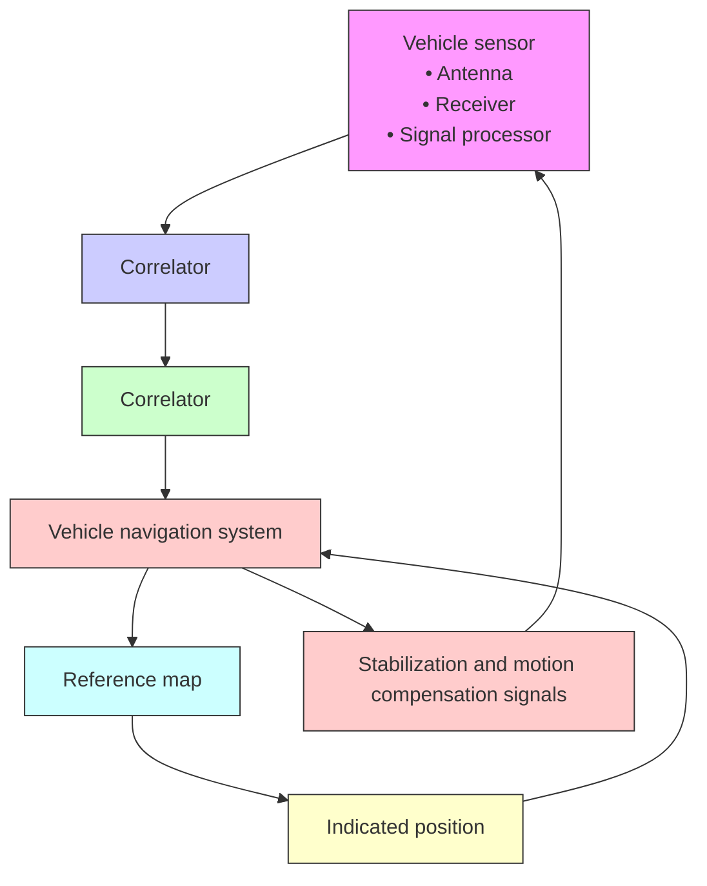

# 7.4.7 TERCOM Position Updating

The concept of utilizing terrain sensor data to obtain a sequence of position fixes has been under investigation since the late 1950s (see Section 7.4.1). As previously mentioned, the objective of the terrain contour matching process is to provide the vehicle’s navigation system with a measured downtrack and crosstrack vehicle position error. Consequently, the navigation system then uses the measured position error to update its estimate of the vehicle’s true geographic position. Usually, a Kalman filter is used to aid in reducing the navigation system’s errors based on the measured vehicle position error.

flowchart

Fig. 7.21. Correlation update-aided navigation system.
