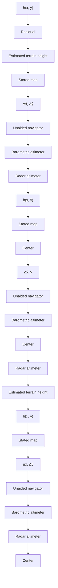

The vehicle receives mission data from the carrier aircraft over the carrier serial data interface and stores it in the vehicle’s onboard digital computer unit memory. The carrier can target and retarget the air vehicle by sending it the desired mission data. The mission data for the air vehicle consist of the following:

• mean column elevation data   
map description data.   
• reference terrain data.   
• waypoint data.

As stated above, a Kalman filter is usually employed to reduce the drift rate of the vehicle’s inertial navigation system. Usually implemented as part of the vehicle’s realtime operational computer program, the Kalman filter software optimally estimates the internal errors in the inertial system (e.g., platform tilt angles in the case of a gimbaled system, and gyro drift rates) based upon the position error measurements that are computed from each terrain correlation position fix. The estimated internal errors are then provided to the inertial navigation system as negative feedback so that the errors in the system’s present position computations can be reduced. Each time a terrain correlation position fix is made, the accuracy of the Kalman filter’s internal error estimate improves, with a resulting decrease in the position error growth rate [9].

flowchart

Fig. 7.23. Terrain-aided navigation concept.
