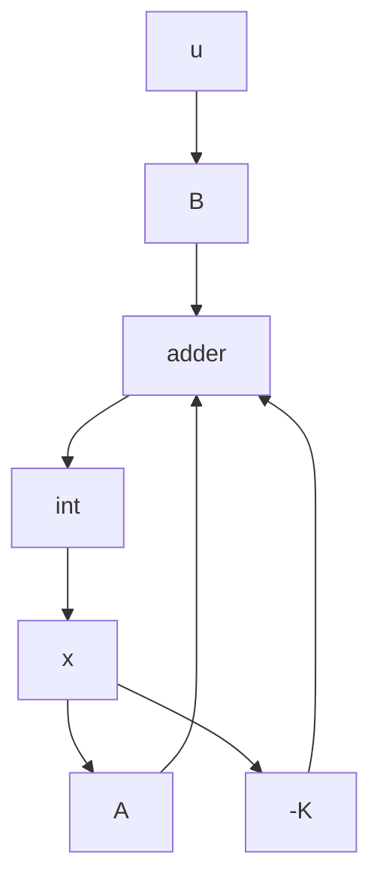

Figure 10–2 Regulator system.

First, we need to check the controllability matrix of the system. Since the controllability matrix M is given by

$$
\mathbf {M} = \left[ \begin{array}{c c c} \mathbf {B} & \mathbf {A B} & \mathbf {A ^ {2} B} \end{array} \right] = \left[ \begin{array}{c c c} 0 & 0 & 1 \\ 0 & 1 & - 6 \\ 1 & - 6 & 3 1 \end{array} \right]
$$

we find that $| \mathbf { M } | = - 1$ , and therefore, rank $\mathbf { M } = 3 .$ Thus, the system is completely state controllable and arbitrary pole placement is possible.

Next, we shall solve this problem.We shall demonstrate each of the three methods presented in this chapter.

Method 1: The first method is to use Equation (10–13).The characteristic equation for the system is

$$
\begin{array}{l} | s \mathbf {I} - \mathbf {A} | = \left| \begin{array}{c c c} s & - 1 & 0 \\ 0 & s & - 1 \\ 1 & 5 & s + 6 \end{array} \right| \\ = s ^ {3} + 6 s ^ {2} + 5 s + 1 \\ = s ^ {3} + a _ {1} s ^ {2} + a _ {2} s + a _ {3} = 0 \\ \end{array}
$$

Hence,

$$a _ {1} = 6, \quad a _ {2} = 5, \quad a _ {3} = 1$$

The desired characteristic equation is

$$
\begin{array}{l} (s + 2 - j 4) (s + 2 + j 4) (s + 1 0) = s ^ {3} + 1 4 s ^ {2} + 6 0 s + 2 0 0 \\ = s ^ {3} + \alpha_ {1} s ^ {2} + \alpha_ {2} s + \alpha_ {3} = 0 \\ \end{array}
$$

Hence,

$$\alpha_ {1} = 1 4, \quad \alpha_ {2} = 6 0, \quad \alpha_ {3} = 2 0 0$$

Referring to Equation (10–13), we have

$$\mathbf {K} = \left[ \alpha_ {3} - a _ {3} \mid \alpha_ {2} - a _ {2} \mid \alpha_ {1} - a _ {1} \right] \mathbf {T} ^ {- 1}$$

where $\mathbf { T } = \mathbf { I }$ for this problem because the given state equation is in the controllable canonical form. Then we have

$$
\begin{array}{l} \mathbf {K} = [ 2 0 0 - 1 \mid 6 0 - 5 \mid 1 4 - 6 ] \\ = \left[ \begin{array}{c c c} 1 9 9 & 5 5 & 8 \end{array} \right] \\ \end{array}
$$

Method 2: By defining the desired state feedback gain matrix K as

$$
\mathbf {K} = \left[ \begin{array}{c c c} k _ {1} & k _ {2} & k _ {3} \end{array} \right]
$$

and equating $| s \mathbf { I } - \mathbf { A } + \mathbf { B } \mathbf { K } |$ with the desired characteristic equation, we obtain
