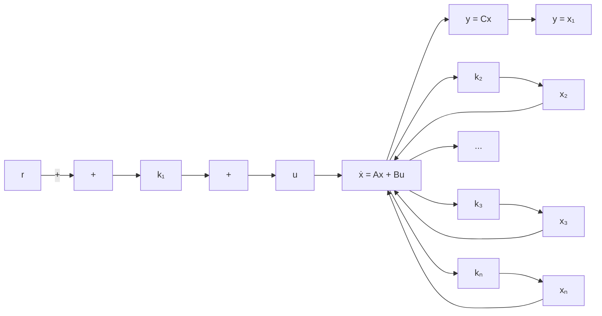

where x = state vector for the plant (n-vector)

u = control signal (scalar)

y = output signal (scalar)

A = n \* n constant matrix

B = n \* 1 constant matrix

C = 1 \* n constant matrix

As stated earlier, we assume that both the control signal u and the output signal y are scalars. By a proper choice of a set of state variables, it is possible to choose the output to be equal to one of the state variables. ASee the method presented in Chapter 2 for obtaining a state-space representation of the transfer function system in which the output y becomes equal to x .B

Figure 10–4 shows a general configuration of the type 1 servo system when the plant has an integrator. Here we assumed that $y = x _ { 1 }$ . In the present analysis we assume that the reference input r is a step function. In this system we use the following state-feedback control scheme:

flowchart

Figure 10–4 Type 1 servo system when the plant has an integrator.

$$
\begin{array}{l} u = - \left[ \begin{array}{l l l l l} 0 & k _ {2} & k _ {3} & \dots & k _ {n} \end{array} \right] \left[ \begin{array}{c} x _ {1} \\ x _ {2} \\ \cdot \\ \cdot \\ \cdot \\ x _ {n} \end{array} \right] + k _ {1} (r - x _ {1}) \\ = - \mathbf {K} \mathbf {x} + k _ {1} r \tag {10-21} \\ \end{array}
$$

where

$$
\mathbf {K} = \left[ \begin{array}{c c c c} k _ {1} & k _ {2} & \dots & k _ {n} \end{array} \right]
$$

Assume that the reference input (step function) is applied at $t = 0 .$ . Then, for $t > 0$ , the system dynamics can be described by Equations (10–19) and (10–21), or

$$\dot {\mathbf {x}} = \mathbf {A} \mathbf {x} + \mathbf {B} u = (\mathbf {A} - \mathbf {B K}) \mathbf {x} + \mathbf {B} k _ {1} r \tag {10-22}$$

We shall design the type 1 servo system such that the closed-loop poles are located at desired positions. The designed system will be an asymptotically stable system, $y ( \infty )$ will approach the constant value r, and $u ( \infty )$ will approach zero. (r is a step input.)

Notice that at steady state we have

$$\dot {\mathbf {x}} (\infty) = (\mathbf {A} - \mathbf {B K}) \mathbf {x} (\infty) + \mathbf {B} k _ {1} r (\infty) \tag {10-23}$$
