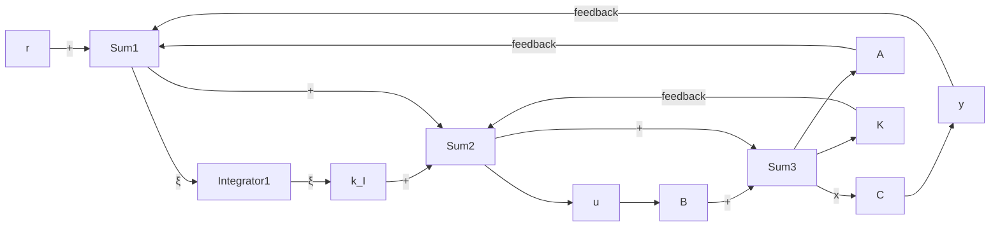

# MATLAB Program 10–5

```matlab
% ---- Unit-step response ----
% ***** Enter the state matrix, control matrix, output matrix,
% and direct transmission matrix of the designed system *****
AA = [0 1 0;0 0 1;-160 -56 -14];
BB = [0;0;160];
CC = [1 0 0];
DD = [0];
% ***** Enter step command and plot command *****
t = 0:0.01:5;
y = step(AA,BB,CC,DD,1,t);
plot(t,y)
grid
title('Unit-Step Response')
xlabel('t Sec')
ylabel('Output y') 
```

Figure 10–5 Unit-step response curve y(t) versus t for the system designed in Example 10–4.   


<details>
<summary>line</summary>

| t Sec | Output y |
| --- | --- |
| 0.0 | 0.0 |
| 0.5 | 0.6 |
| 1.0 | 1.15 |
| 1.5 | 1.0 |
| 2.0 | 0.98 |
| 2.5 | 1.0 |
| 3.0 | 1.0 |
| 3.5 | 1.0 |
| 4.0 | 1.0 |
| 4.5 | 1.0 |
| 5.0 | 1.0 |
</details>

Note that since

$$u (\infty) = - \mathbf {K x} (\infty) + k _ {1} r (\infty) = - \mathbf {K x} (\infty) + k _ {1} r$$

we have

$$
\begin{array}{l} u (\infty) = - [ 1 6 0 \quad 5 4 \quad 1 1 ] \left[ \begin{array}{l} x _ {1} (\infty) \\ x _ {2} (\infty) \\ x _ {3} (\infty) \end{array} \right] + 1 6 0 r \\ = - \left[ \begin{array}{l l l} 1 6 0 & 5 4 & 1 1 \end{array} \right] \left[ \begin{array}{l} r \\ 0 \\ 0 \end{array} \right] + 1 6 0 r = 0 \\ \end{array}
$$

At steady state the control signal u becomes zero.

Design of Type 1 Servo System when the Plant Has No Integrator. If the plant has no integrator (type 0 plant), the basic principle of the design of a type 1 servo system is to insert an integrator in the feedforward path between the error comparator and the plant, as shown in Figure 10–6. (The block diagram of Figure 10–6 is a basic form of the type 1 servo system where the plant has no integrator.) From the diagram, we obtain

$$\dot {\mathbf {x}} = \mathbf {A} \mathbf {x} + \mathbf {B} u \tag {10-31}y = \mathbf {C x} \tag {10-32}u = - \mathbf {K} \mathbf {x} + k _ {I} \xi \tag {10-33}\dot {\xi} = r - y = r - \mathbf {C x} \tag {10-34}$$

where x = state vector of the plant (n-vector)

Figure 10–6   
Type 1 servo system.   


<details>
<summary>flowchart</summary>


</details>
