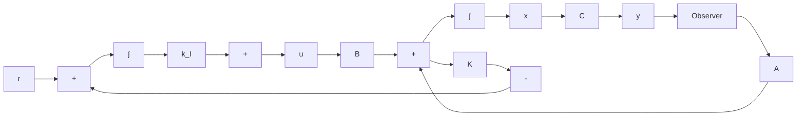

If the desired eigenvalues of matrix $\hat { \mathbf { A } } - \hat { \mathbf { B } } \hat { \mathbf { K } }$ (that is, the desired closed-loop poles) are specified as $\mu _ { 1 } , \mu _ { 2 } , \ldots , \mu _ { n + 1 }$ , then the state-feedback gain matrix K and the integral gain constant $k _ { I }$ can be determined by the pole-placement technique presented in Section 10–2, provided that the system defined by Equation (10–40) is completely state controllable. Note that if the matrix

$$
\left[ \begin{array}{c c} \mathbf {A} & \mathbf {B} \\ - \mathbf {C} & 0 \end{array} \right]
$$

has rank $n + 1$ , then the system defined by Equation (10–40) is completely state controllable. (See Problem A–10–12.)

flowchart

Figure 10–7 Type 1 servo system with state observer.

As is usually the case, not all state variables can be directly measurable. If this is the case, we need to use a state observer. Figure 10–7 shows a block diagram of a type 1 servo system with a state observer. [In the figure, each block with an integral symbol represents an integrator (1/s).] Detailed discussions of state observers are given in Section 10–5.
