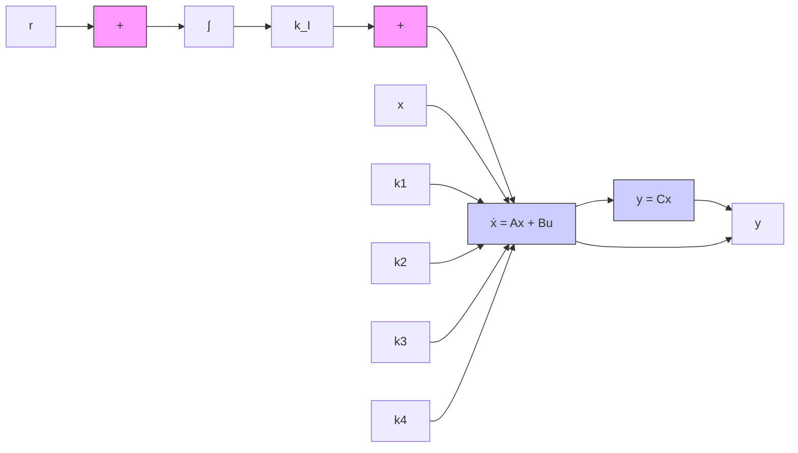

# EXAMPLE 10–5

Consider the inverted-pendulum control system shown in Figure 10–8. In this example, we are concerned only with the motion of the pendulum and motion of the cart in the plane of the page.

It is desired to keep the inverted pendulum upright as much as possible and yet control the position of the cart—for instance, move the cart in a step fashion. To control the position of the cart, we need to build a type 1 servo system. The inverted-pendulum system mounted on a cart does not have an integrator.Therefore, we feed the position signal y (which indicates the position of the cart) back to the input and insert an integrator in the feedforward path, as shown in Figure 10–9.We assume that the pendulum angle u and the angular velocity# $\dot { \theta }$ are small, so that sin $\theta \doteq \theta , \cos \theta \doteq 1$ and, $\theta \dot { \theta } ^ { 2 } \doteq 0 .$ We also assume that the numerical values for M, m, and l are. given as

Figure 10–8 Inverted-pendulum control system.   

text_image

z
x → ℓ sin θ
ℓ cos θ
θ
m
mg
ℓ
0 → x
P
u → M

Figure 10–9 Inverted-pendulum control system. (Type 1 servo system when the plant has no integrator.)   

flowchart

$$M = 2 \mathrm{kg}, \quad m = 0. 1 \mathrm{kg}, \quad l = 0. 5 \mathrm{m}$$

Earlier in Example 3–6 we derived the equations for the inverted-pendulum system shown in Figure 3–6, which is the same as that in Figure 10–8. Referring to Figure 3–6, we started with the force-balance and torque-balance equations and ended up with Equations (3–20) and (3–21) to model the inverted-pendulum system. Referring to Equations (3–20) and (3–21), the equations for the inverted-pendulum control system shown in Figure 10–8 are

$$M l \ddot {\theta} = (M + m) g \theta - u \tag {10-43}M \ddot {x} = u - m g \theta \tag {10-44}$$

When the given numerical values are substituted, Equations (10–43) and (10–44) become
