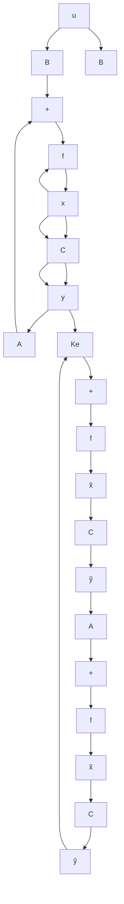

The observer is a subsystem to reconstruct the state vector of the plant. The mathematical model of the observer is basically the same as that of the plant, except that we include an additional term that includes the estimation error to compensate for inaccuracies in matrices A and B and the lack of the initial error. The estimation error or observation error is the difference between the measured output and the estimated output.The initial error is the difference between the initial state and the initial estimated state. Thus, we define the mathematical model of the observer to be

$$
\begin{array}{l} \dot {\widetilde {\mathbf {x}}} = \mathbf {A} \widetilde {\mathbf {x}} + \mathbf {B} u + \mathbf {K} _ {e} (y - \mathbf {C} \widetilde {\mathbf {x}}) \\ = \left(\mathbf {A} - \mathbf {K} _ {e} \mathbf {C}\right) \widetilde {\mathbf {x}} + \mathbf {B} u + \mathbf {K} _ {e} y \tag {10-57} \\ \end{array}
$$

where is the estimated state and is the estimated output.The inputs to the observerC x- xare the output y and the control input u. Matrix K , which is called the observer gain matrix, is a weighting matrix to the correction term involving the difference between the measured output y and the estimated output $\mathbf { C } \widetilde { \mathbf { x } }$ This term continuously corrects. the model output and improves the performance of the observer. Figure 10–11 shows the block diagram of the system and the full-order state observer.

Figure 10–11 Block diagram of system and full-order state observer, when input u and output y are scalars.   

flowchart

Full-order state observer

Full-Order State Observer. The order of the state observer that will be discussed here is the same as that of the plant. Assume that the plant is defined by Equations (10–55) and (10–56) and the observer model is defined by Equation (10–57).

To obtain the observer error equation, let us subtract Equation (10–57) from Equation (10–55):
