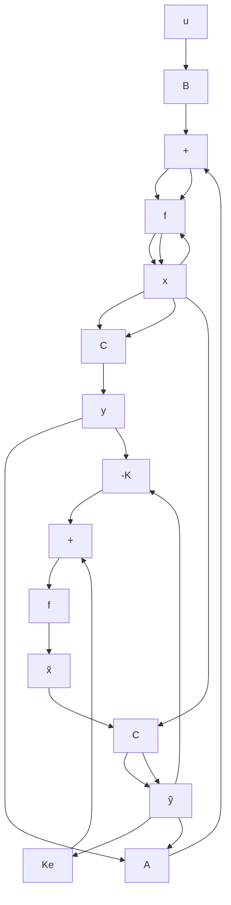

Consider the completely state controllable and completely observable system defined by the equations

$$\dot {\mathbf {x}} = \mathbf {A} \mathbf {x} + \mathbf {B} uy = \mathbf {C x}$$

For the state-feedback control based on the observed state $\widetilde { \mathbf { x } }$ ,

$$u = - \mathbf {K} \widetilde {\mathbf {x}}$$

With this control, the state equation becomes

$$\dot {\mathbf {x}} = \mathbf {A} \mathbf {x} - \mathbf {B} \mathbf {K} \widetilde {\mathbf {x}} = (\mathbf {A} - \mathbf {B} \mathbf {K}) \mathbf {x} + \mathbf {B} \mathbf {K} (\mathbf {x} - \widetilde {\mathbf {x}}) \tag {10-67}$$

The difference between the actual state $\mathbf { x } ( t )$ and the observed state $\widetilde { \mathbf { x } } \left( t \right)$ has been defined as the error $\mathbf { e } ( t )$ :

$$\mathbf {e} (t) = \mathbf {x} (t) - \widetilde {\mathbf {x}} (t)$$

Substitution of the error vector e(t) into Equation (10–67) gives

$$\dot {\mathbf {x}} = (\mathbf {A} - \mathbf {B K}) \mathbf {x} + \mathbf {B K e} \tag {10-68}$$

Note that the observer error equation was given by Equation (10–59), repeated here:

$$\dot {\mathbf {e}} = \left(\mathbf {A} - \mathbf {K} _ {e} \mathbf {C}\right) \mathbf {e} \tag {10-69}$$

Combining Equations (10–68) and (10–69), we obtain

$$
\left[ \begin{array}{c} \dot {\mathbf {x}} \\ \dot {\mathbf {e}} \end{array} \right] = \left[ \begin{array}{c c} \mathbf {A} - \mathbf {B K} & \mathbf {B K} \\ \mathbf {0} & \mathbf {A} - \mathbf {K} _ {e} \mathbf {C} \end{array} \right] \left[ \begin{array}{c} \mathbf {x} \\ \mathbf {e} \end{array} \right] \tag {10-70}
$$

Equation (10–70) describes the dynamics of the observed-state feedback control system. The characteristic equation for the system is

$$
\left| \begin{array}{c c} s \mathbf {I} - \mathbf {A} + \mathbf {B K} & - \mathbf {B K} \\ \mathbf {0} & s \mathbf {I} - \mathbf {A} + \mathbf {K} _ {e} \mathbf {C} \end{array} \right| = 0
$$

or

$$\left| s \mathbf {I} - \mathbf {A} + \mathbf {B K} \right| \left| s \mathbf {I} - \mathbf {A} + \mathbf {K} _ {e} \mathbf {C} \right| = 0$$
