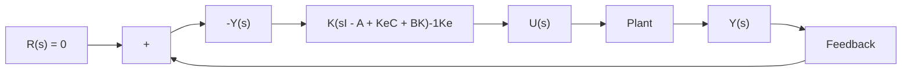

$$\frac {U (s)}{- Y (s)} = \frac {\text { num }}{\text { den }} = \mathbf {K} (s \mathbf {I} - \mathbf {A} + \mathbf {K} _ {e} \mathbf {C} + \mathbf {B} \mathbf {K}) ^ {- 1} \mathbf {K} _ {e} \tag {10-74}$$

Figure 10–13 Block diagram representation of system with a controller-observer.   

flowchart

the observer-based controller transfer function or, simply, the observer-controller transfer function.

Note that the observer-controller matrix

$$\mathbf {A} - \mathbf {K} _ {e} \mathbf {C} - \mathbf {B K}$$

may or may not be stable, although A-BK and $\mathbf { A } - \mathbf { K } _ { e } \mathbf { C }$ are chosen to be stable. In fact, in some cases the matrix $\mathbf { A } - \mathbf { K } _ { e } \mathbf { C } - \mathbf { B } \mathbf { K }$ may be poorly stable or even unstable.

EXAMPLE 10–7 Consider the design of a regulator system for the following plant:

$$\dot {\mathbf {x}} = \mathbf {A} \mathbf {x} + \mathbf {B} u \tag {10-75}y = \mathbf {C x} \tag {10-76}$$

where

$$
\mathbf {A} = \left[ \begin{array}{c c} 0 & 1 \\ 2 0. 6 & 0 \end{array} \right], \quad \mathbf {B} = \left[ \begin{array}{c} 0 \\ 1 \end{array} \right], \quad \mathbf {C} = \left[ \begin{array}{c c} 1 & 0 \end{array} \right]
$$

Suppose that we use the pole-placement approach to the design of the system and that the desired closed-loop poles for this system are at $s = \mu _ { i } \left( i = 1 , 2 \right)$ , where $\mu _ { 1 } = - 1 . 8 + j 2 . 4$ and $\mu _ { 2 } = - 1 . 8 - j 2 . 4 .$ . The state-feedback gain matrix K for this case can be obtained as follows:

$$
\mathbf {K} = \left[ \begin{array}{c c} 2 9. 6 & 3. 6 \end{array} \right]
$$

Using this state-feedback gain matrix K, the control signal u is given by

$$
u = - \mathbf {K x} = - [ 2 9. 6 \quad 3. 6 ] \left[ \begin{array}{c} x _ {1} \\ x _ {2} \end{array} \right]
$$

Suppose that we use the observed-state feedback control instead of the actual-state feedback control, or

$$
u = - \mathbf {K} \widetilde {\mathbf {x}} = - [ 2 9. 6 \quad 3. 6 ] \left[ \begin{array}{c} \widetilde {x} _ {1} \\ \widetilde {x} _ {2} \end{array} \right]
$$

where we choose the observer poles to be at

$$s = - 8, \quad s = - 8$$
