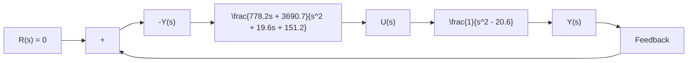

Referring to Equation (10–74), the transfer function of the observer-controller is

$$
\begin{array}{l} \frac {U (s)}{- Y (s)} = \mathbf {K} \left(s \mathbf {I} - \mathbf {A} + \mathbf {K} _ {e} \mathbf {C} + \mathbf {B K}\right) ^ {- 1} \mathbf {K} _ {e} \\ = \left[ \begin{array}{c c} 2 9. 6 & 3. 6 \end{array} \right] \left[ \begin{array}{c c} s + 1 6 & - 1 \\ 9 3. 6 & s + 3. 6 \end{array} \right] ^ {- 1} \left[ \begin{array}{c} 1 6 \\ 8 4. 6 \end{array} \right] \\ = \frac {7 7 8 . 2 s + 3 6 9 0 . 7}{s ^ {2} + 1 9 . 6 s + 1 5 1 . 2} \\ \end{array}
$$

As a matter of course, the same transfer function can be obtained with MATLAB. For example, MATLAB Program 10–8 produces the transfer function of the observer controller. Figure 10–14(b) shows a block diagram of the system.

<table><tr><td>MATLAB Program 10-8</td></tr><tr><td>% Obtaining transfer function of observer controller --- full-order observer</td></tr><tr><td>A = [0 1;20.6 0];</td></tr><tr><td>B = [0;1];</td></tr><tr><td>C = [1 0];</td></tr><tr><td>K = [29.6 3.6];</td></tr><tr><td>Ke = [16;84.6];</td></tr><tr><td>AA = A-Ke*C-B*K;</td></tr><tr><td>BB = Ke;</td></tr><tr><td>CC = K;</td></tr><tr><td>DD = 0;</td></tr><tr><td>[num,den] = ss2tf(AA,BB,CC,DD)</td></tr><tr><td>num =</td></tr><tr><td>1.0e+003*</td></tr><tr><td>0 0.7782 3.6907</td></tr><tr><td>den =</td></tr><tr><td>1.0000 19.6000 151.2000</td></tr></table>

The dynamics of the observed-state feedback control system just designed can be described by the following equations: For the plant,

$$
\left[ \begin{array}{c} \dot {x} _ {1} \\ \dot {x} _ {2} \end{array} \right] = \left[ \begin{array}{c c} 0 & 1 \\ 2 0. 6 & 0 \end{array} \right] \left[ \begin{array}{c} x _ {1} \\ x _ {2} \end{array} \right] + \left[ \begin{array}{c} 0 \\ 1 \end{array} \right] u

y = \left[ \begin{array}{c c} 1 & 0 \end{array} \right] \left[ \begin{array}{c} x _ {1} \\ x _ {2} \end{array} \right]
$$

For the observer,
