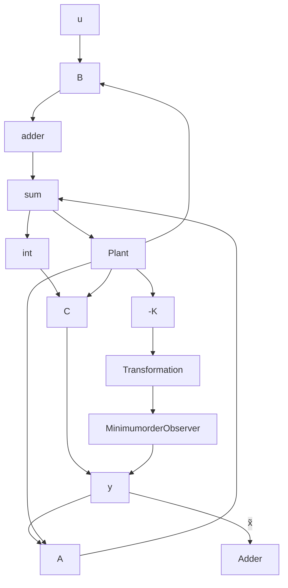

MATLAB Program 10–9   
A = [0 1; 20.6 0];
B = [0;1];
C = [1 0];
K = [29.6 3.6];
Ke = [16; 84.6];
sys = ss([A-B*K B*K; zeros(2,2) A-Ke*C], eye(4), eye(4), eye(4));
t = 0:0.01:4;
z = initial(sys,[1;0;0.5;0], t);
x1 = [1 0 0 0]*z';
x2 = [0 1 0 0]*z';
e1 = [0 0 1 0]*z';
e2 = [0 0 0 1]*z';
subplot(2,2,1); plot(t,x1 ), grid
title('Response to Initial Condition')
ylabel('state variable x1')

subplot(2,2,2); plot(t,x2), grid
title('Response to Initial Condition')
ylabel('state variable x2')

subplot(2,2,3); plot(t,e1), grid
xlabel('t (sec)'), ylabel('error state variable e1')

subplot(2,2,4); plot(t,e2), grid
xlabel('t (sec)'), ylabel('error state variable e2')

Figure 10–15 Response curves to initial condition.   

Minimum-Order Observer. The observers discussed thus far are designed to reconstruct all the state variables. In practice, some of the state variables may be accurately measured. Such accurately measurable state variables need not be estimated.

Suppose that the state vector x is an n-vector and the output vector y is an m-vector that can be measured. Since m output variables are linear combinations of the state variables, m state variables need not be estimated. We need to estimate only n-m state variables. Then the reduced-order observer becomes an (n-m)th-order observer. Such an (n-m)th-order observer is the minimum-order observer. Figure 10–16 shows the block diagram of a system with a minimum-order observer.

Figure 10–16 Observed-state feedback control system with a minimum-order observer.   

flowchart

It is important to note, however, that if the measurement of output variables involves significant noises and is relatively inaccurate, then the use of the full-order observer may result in a better system performance.
