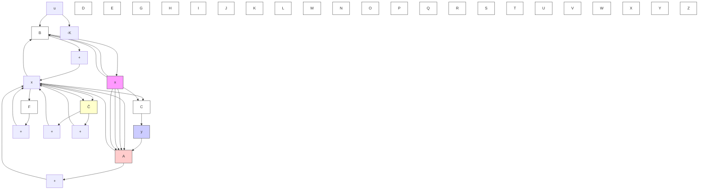

By subtracting Equation (10–92) from Equation (10–84), we obtain

$$\dot {\mathbf {x}} _ {b} - \tilde {\dot {\mathbf {x}}} _ {b} = \left(\mathbf {A} _ {b b} - \mathbf {K} _ {e} \mathbf {A} _ {a b}\right) \left(\mathbf {x} _ {b} - \tilde {\mathbf {x}} _ {b}\right) \tag {10-93}$$

Define

$$\mathbf {e} = \mathbf {x} _ {b} - \widetilde {\mathbf {x}} _ {b} = \boldsymbol {\eta} - \widetilde {\boldsymbol {\eta}}$$

Then Equation (10–93) becomes

$$\dot {\mathbf {e}} = \left(\mathbf {A} _ {b b} - \mathbf {K} _ {e} \mathbf {A} _ {a b}\right) \mathbf {e} \tag {10-94}$$

This is the error equation for the minimum-order observer. Note that e is an (n-1)- vector.

The error dynamics can be chosen as desired by following the technique developed for the full-order observer, provided that the rank of matrix

$$
\left[ \begin{array}{c} \mathbf {A} _ {a b} \\ \mathbf {A} _ {a b} \mathbf {A} _ {b b} \\ \cdot \\ \cdot \\ \cdot \\ \mathbf {A} _ {a b} \mathbf {A} _ {b b} ^ {n - 2} \end{array} \right]
$$

is n-1. (This is the complete observability condition applicable to the minimum-order observer.)
